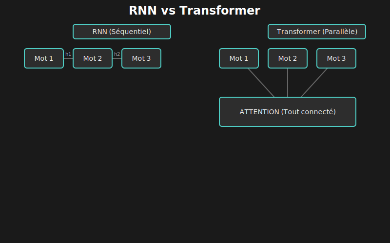
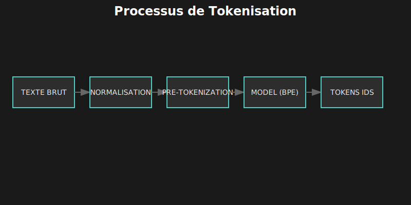
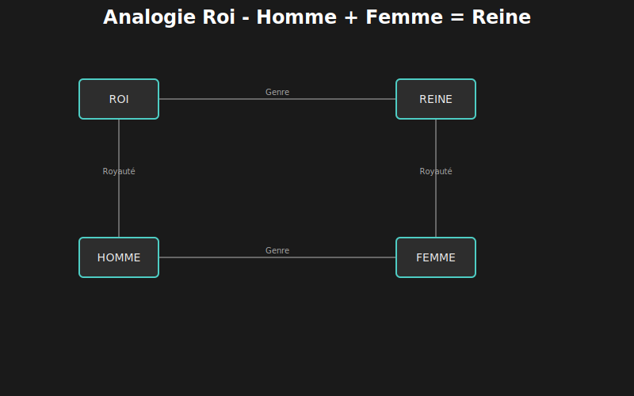
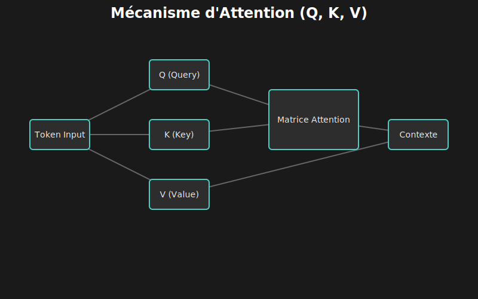
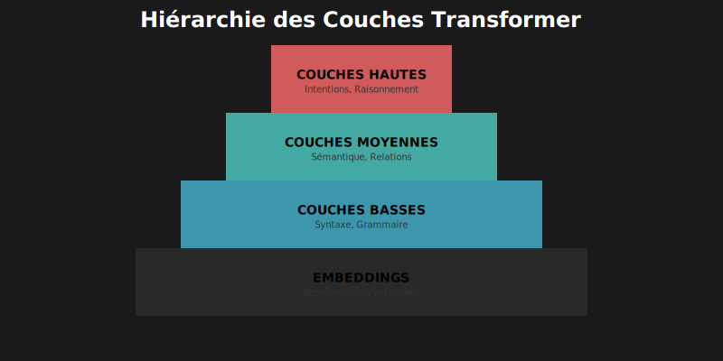
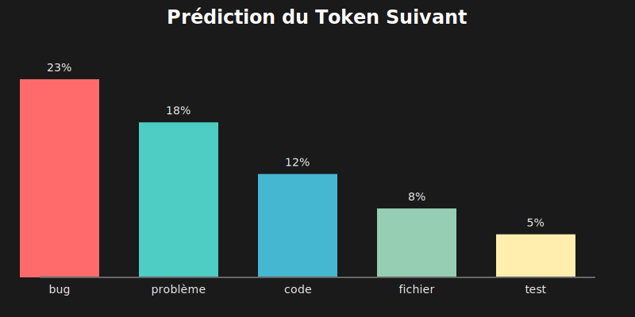
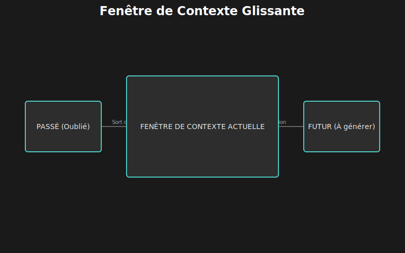
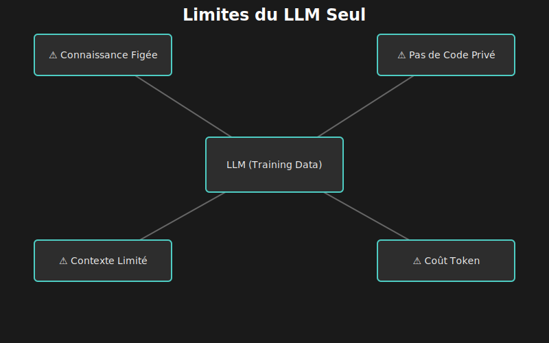
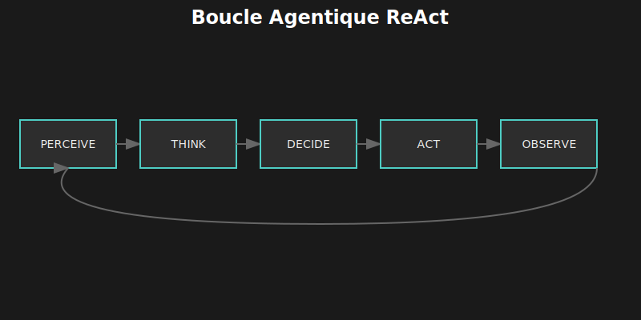

# 🧠 Chapitre 1 : Comprendre les Large Language Models

---

## 🎬 Scène d'ouverture : La Question Fondamentale

*Un mardi soir, dans un café près du campus universitaire...*

Lina fixait son écran, perplexe. Elle venait de passer trois heures à interagir avec ChatGPT, lui demandant d'expliquer du code, de générer des tests, de suggérer des refactorisations. Les résultats étaient tantôt brillants, tantôt absurdes.

— "Comment ça peut être si intelligent et si stupide à la fois ?" murmura-t-elle.

Son ami Marcus, doctorant en machine learning, s'assit à côté d'elle avec son café.

— "Tu sais comment ça fonctionne, un LLM ?"

Lina haussa les épaules. "Vaguement. Des réseaux de neurones, beaucoup de données, quelque chose avec l'attention..."

Marcus sourit. "C'est un bon début. Mais si tu veux vraiment construire des outils qui utilisent ces modèles, tu dois comprendre ce qu'ils sont *vraiment*. Pas la version marketing. La vraie mécanique."

Il sortit un carnet et commença à dessiner. "Laisse-moi te raconter une histoire. Elle commence en 2017, dans les bureaux de Google..."

---

## 📜 1.1 Une Brève Histoire des Modèles de Langage

### 1.1.1 Avant les Transformers : L'Ère Séquentielle (RNN)

Pour comprendre la puissance des LLMs actuels, il faut regarder en arrière. Pendant longtemps, les Réseaux de Neurones Récurrents (RNN) étaient la norme.

Leur fonctionnement était **séquentiel** : ils lisaient le texte mot par mot, de gauche à droite, en essayant de garder en mémoire le contexte précédent.



Le problème ? Comme le jeu du "téléphone arabe", l'information se dégradait sur la longueur. Le début de la phrase était souvent "oublié" avant la fin. De plus, impossible de paralléliser le calcul : il fallait attendre le traitement du mot 1 pour traiter le mot 2.

### 1.1.2 ⚡ La Révolution : "Attention Is All You Need" (2017)

En 2017, l'architecture **Transformer** a tout changé en introduisant le mécanisme d'**Attention**.

L'idée radicale : au lieu de lire séquentiellement, le modèle regarde **tous les mots en même temps**. Chaque mot peut "prêter attention" à n'importe quel autre mot de la phrase, quelle que soit la distance qui les sépare.

| 📈 Comparatif | RNN (Ancien) | Transformer (Moderne) |
|:--------------|:-------------|:----------------------|
| **Traitement** | Séquentiel (lent) | Parallèle (rapide sur GPU) |
| **Mémoire** | Courte (oublie vite) | Longue (tout le contexte) |
| **Distance** | Limitée | Illimitée (accès direct) |

---

## 🔬 1.2 L'Anatomie d'un Transformer

Plongeons dans le moteur. Comment le texte devient-il du sens ?

### 1.2.1 ✂️ La Tokenisation : Découper le Langage

Le modèle ne lit pas du texte, il manipule des nombres. La première étape est donc de découper le texte en unités appelées **tokens**.



Ce découpage utilise souvent le **Byte-Pair Encoding (BPE)**, qui optimise le vocabulaire en gardant les mots fréquents entiers et en découpant les mots rares en syllabes.

#### 🧪 Laboratoire : La Tokenisation en Pratique

Voici comment visualiser la tokenisation réelle avec la librairie `tiktoken` (utilisée par OpenAI) :

```typescript
import { encoding_for_model } from "tiktoken";

// On charge l'encodeur de GPT-4
const enc = encoding_for_model("gpt-4");

const text = "Le développeur code bien";
const tokens = enc.encode(text);

console.log(`Texte: "${text}"`);
console.log(`Tokens (IDs): [${tokens.join(", ")}]`);
console.log(`Nombre de tokens: ${tokens.length}`);

// Décodons pour voir ce que chaque token représente
tokens.forEach(id => {
  console.log(`${id} -> "${new TextDecoder().decode(enc.decode([id]))}"`);
});

// Résultat typique :
// "Le" -> 1 token
// " dé" -> 1 token
// "velopp" -> 1 token (mot découpé !)
// "eur" -> 1 token
// ...
```

> ⚠️ **Attention aux coûts** : Les modèles facturent au token. Un code mal formaté ou verbeux coûte plus cher. Notez aussi que les caractères non-latins (chinois, emojis) prennent souvent plus de tokens.

### 1.2.2 🎯 Les Embeddings : L'Espace du Sens

Une fois tokenisé, chaque mot est transformé en un **vecteur** (une liste de nombres, par ex. 1536 dimensions pour GPT-3). C'est son **embedding**.

La magie, c'est que la position dans cet espace vectoriel capture le **sens**.



Le modèle "apprend" que :
- `Roi - Homme + Femme ≈ Reine`
- `Paris - France + Japon ≈ Tokyo`
- `function - javascript + python ≈ def`

C'est cette propriété qui permet la recherche sémantique (RAG) : on peut trouver du code pertinent même si les mots-clés ne sont pas exactement les mêmes.

### 1.2.3 👁️ Le Mécanisme d'Attention

C'est le cœur du réacteur. Pour chaque token, le modèle se pose trois questions, formalisées par trois vecteurs : **Query (Q)**, **Key (K)**, et **Value (V)**.



Imaginez une base de données floue :
1.  **Query (Q)** : "Je suis le token `items`. Je cherche mon contexte."
2.  **Key (K)** : Les autres tokens répondent. "Moi `total`, je suis pertinent à 10%". "Moi `price`, je suis pertinent à 90%".
3.  **Value (V)** : On récupère l'information des tokens pertinents pour enrichir le sens de `items`.

Grâce à cela, quand le modèle lit `it` dans "The cat ate the mouse because it was hungry", il sait que `it` fait référence à `cat`. Si la phrase était "because it was delicious", `it` ferait référence à `mouse`.

### 1.2.4 📚 La Hiérarchie des Couches

Un LLM empile des dizaines de ces couches d'attention (96 pour GPT-3).



*   **Couches basses** : Comprennent la syntaxe (où mettre les virgules, les parenthèses).
*   **Couches moyennes** : Comprennent la sémantique (le code compile, les types correspondent).
*   **Couches hautes** : Comprennent l'intention et le raisonnement (ce que le code *fait*).

---

## ⚙️ 1.3 Comment un LLM Génère du Texte

### 1.3.1 🎲 La Prédiction du Token Suivant

Les LLMs sont des **prédicteurs statistiques**. Ils ne "réfléchissent" pas avant de parler ; ils calculent la probabilité du prochain mot.



Face à `def calculate_`, le modèle attribue des probabilités :
- `total` : 40%
- `sum` : 20%
- `price` : 10%
- `banana` : 0.001%

### 1.3.2 🌡️ La Température : Créativité vs Précision

Vous pouvez contrôler comment le modèle choisit dans cette liste via la **température**.

*   **Température 0** : Prend toujours le mot le plus probable (déterministe). Idéal pour le code.
*   **Température 1** : Pioche parfois des mots moins probables. Idéal pour la poésie ou le brainstorming.

### 1.3.3 📏 La Fenêtre de Contexte

Le modèle a une mémoire de travail limitée : la fenêtre de contexte.



Tout ce qui sort de cette fenêtre (vers la gauche) est définitivement oublié. C'est pourquoi les agents doivent utiliser des mémoires externes (bases de données, fichiers) pour gérer des projets entiers.

---

## ⚠️ 1.4 Les Limites et les Agents

Même avec toute cette puissance, un LLM "nu" a des limites critiques :



1.  **Connaissances figées** : Il ne connaît pas les librairies sorties après sa date d'entraînement.
2.  **Pas d'action** : Il ne peut pas lancer le code qu'il écrit.
3.  **Hallucinations** : Il peut inventer des faits avec une assurance totale.

### 1.4.1 La Solution : L'Agent (Boucle ReAct)

C'est là qu'intervient l'Agent. Au lieu de juste répondre, l'agent entre dans une boucle de réflexion et d'action.



1.  **Think** : "Je dois vérifier si ce fichier existe."
2.  **Act** : Exécute la commande `ls`.
3.  **Observe** : Lit le résultat réel.
4.  **Think** : "Ah, il n'existe pas. Je dois le créer."

Cette boucle permet à l'agent de **vérifier ses hypothèses** et de corriger ses erreurs, le rendant bien plus fiable qu'un simple chat.

---

## 📝 1.5 Points Clés à Retenir

*   **Transformers** : Architecture parallèle basée sur l'Attention.
*   **Tokens** : Unités de base, le coût dépend du découpage.
*   **Probabiliste** : Le modèle prédit la suite logique, pas forcément la vérité.
*   **Agent** : Enveloppe le LLM avec des outils et une boucle d'exécution pour compenser ses limites.

---

| ⬅️ Précédent | 📖 Sommaire | ➡️ Suivant |
|:-------------|:-----------:|:-----------|
| [Avant-propos](00-avant-propos.md) | [Index](README.md) | [Le Rôle des Agents](02-role-des-agents.md) |
