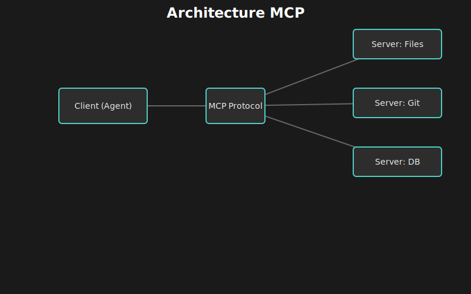
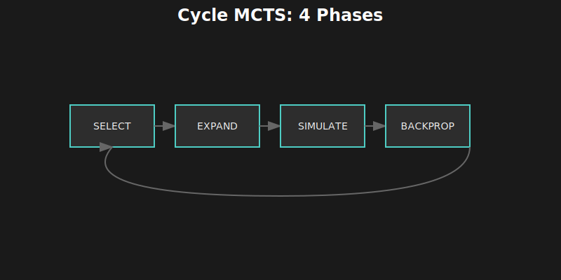
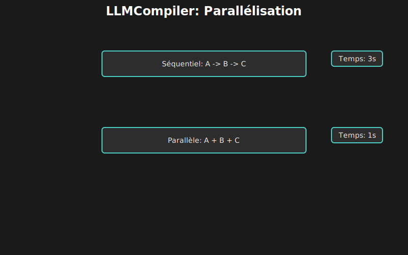
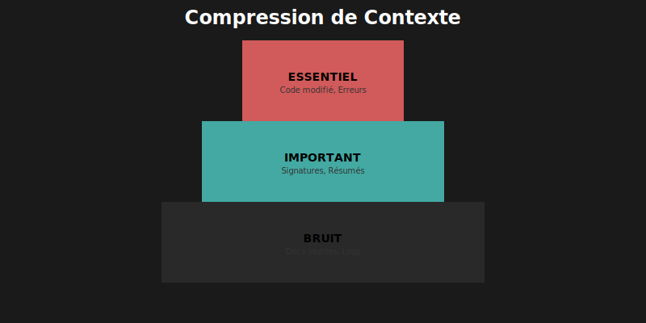
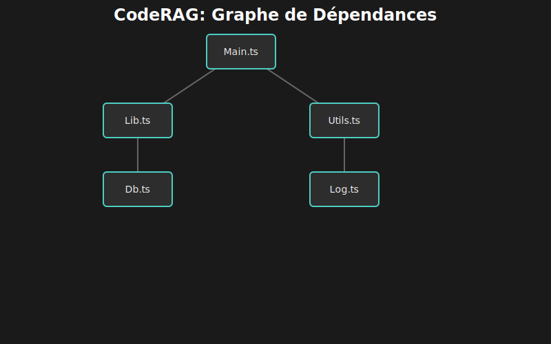

# 🤖 Chapitre 2 : Le Rôle des Agents dans l'Écosystème IA

---

## 🎬 Scène d'ouverture : La Confusion du Buzzword

*Salle de réunion, le lendemain matin...*

Lina présentait son prototype à l'équipe. Sur l'écran, un terminal noir avec une interface minimaliste — son chatbot amélioré qui pouvait lire des fichiers et exécuter du code.

Marc, le lead technique, croisa les bras.

— "C'est cool, mais AutoGPT fait déjà ça, non ? Et Claude Code, et Cursor, et Copilot... Tout le monde prétend avoir un 'agent IA' maintenant."

Lina hésita. Elle *savait* que son prototype était différent, mais comment l'expliquer clairement ?

— "La différence," commença-t-elle prudemment, "c'est dans ce qu'ils font réellement. Un chatbot te donne une réponse. Un assistant te donne de l'aide. Mais un **agent**..."

Elle fit une pause dramatique.

— "Un agent **résout** le problème. Tout seul. De bout en bout."

Sophie, la PM, fronça les sourcils.

— "Mais Copilot m'aide à écrire du code. Ce n'est pas un agent ?"

— "Non. Copilot te suggère du code. Tu dois valider, corriger, intégrer. Lui ne peut pas lancer les tests, voir qu'ils échouent, comprendre pourquoi, et corriger jusqu'à ce que ça marche. Un vrai agent, si."

Le silence dans la salle indiqua qu'elle avait touché une corde sensible.

— "Laissez-moi vous montrer la différence..."

---

## 📚 2.1 Une Taxonomie Claire des Systèmes IA

Le terme "agent IA" est devenu l'un des buzzwords les plus galvaudés de 2024. Startups, entreprises établies, et projets open-source — tous revendiquent avoir un "agent". Mais cette confusion terminologique masque des différences fondamentales en termes de capacités et d'architecture.

### 2.1.1 📊 Les Quatre Niveaux d'Intelligence Artificielle Appliquée

Au fil des années, une hiérarchie naturelle a émergé :


Cette pyramide n'est pas qu'une taxonomie académique — elle a des implications pratiques directes sur ce que chaque système peut accomplir.

### 2.1.2 📋 Tableau Comparatif Détaillé

| Aspect | 💬 Chatbot | ⚡ Assistant | 🚀 Agent | 🤝 Multi-Agent |
|:-------|:-----------|:-------------|:---------|:---------------|
| **Mémoire** | Session uniquement | Session + documents | Persistante | Partagée entre agents |
| **Outils** | 0 | 1-5 | 10-50+ | Spécialisés par rôle |
| **Autonomie** | Aucune | Guidée par l'humain | Boucle autonome | Coordination autonome |
| **Reasoning** | Linéaire | Chain-of-thought | ToT, MCTS | Distribué |
| **Feedback** | Aucun | De l'utilisateur | Auto-évaluation | Inter-agents |
| **Qui décide ?** | L'humain, toujours | L'humain, souvent | L'agent, supervisé | Les agents, négocié |
| **Exemple** | FAQ bot | GitHub Copilot | Grok-CLI | MetaGPT |

### 2.1.3 🎚️ Le Spectre de l'Autonomie

La différence fondamentale entre ces niveaux n'est pas technologique — c'est le **degré d'autonomie** accordé au système.


> 💡 **Point crucial** : Plus l'autonomie augmente, plus la **confiance** et la **sécurité** deviennent critiques.

---

## 🕰️ 2.2 L'Évolution vers les Agents (2020-2025)

### 2.2.1 📅 Chronologie des Innovations Clés


### 2.2.2 🔑 Les Quatre Catalyseurs Technologiques

Ce ne sont pas les LLMs seuls qui ont rendu les agents possibles. Quatre innovations spécifiques ont été déterminantes :

#### 1️⃣ Function Calling (2023)

Avant le function calling, les LLMs ne pouvaient que générer du texte. Demander l'exécution d'un outil nécessitait du parsing complexe et peu fiable.


Grâce au JSON structuré, on passe d'un bricolage fragile à une API typée et fiable.

#### 🧪 Laboratoire : Function Calling en Action

Voici à quoi ressemble une définition d'outil réelle (format OpenAI) :

```json
{
  "name": "read_file",
  "description": "Reads the content of a file",
  "parameters": {
    "type": "object",
    "properties": {
      "filepath": {
        "type": "string",
        "description": "The path to the file relative to project root"
      }
    },
    "required": ["filepath"]
  }
}
```

Et la réponse du modèle n'est plus du texte, mais :

```json
{
  "tool_calls": [
    {
      "id": "call_abc123",
      "type": "function",
      "function": {
        "name": "read_file",
        "arguments": "{\"filepath\": \"src/index.ts\"}"
      }
    }
  ]
}
```

L'agent n'a plus qu'à parser ce JSON et exécuter la fonction.

#### 2️⃣ Fenêtres de Contexte Étendues (2023-2024)
Avec 200K tokens (Claude 3), un agent peut voir ~100 fichiers simultanément.

#### 3️⃣ Benchmarks Standardisés (2023-2024)
SWE-bench (Software Engineering Benchmark) a permis de mesurer réellement la capacité à résoudre des tickets GitHub (environ 30% de succès en 2024).

#### 4️⃣ MCP Protocol (2024)
Anthropic a standardisé la communication Agent-Outils.



---

## 📖 2.3 Les Travaux de Recherche Fondamentaux

Grok-CLI s'appuie sur des années de recherche.

### 2.3.1 🌳 Tree-of-Thought (Yao et al., 2023)

**Le problème** : Le raisonnement linéaire échoue sur les problèmes complexes.
**La solution** : Explorer plusieurs branches comme un arbre d'échecs.


### 2.3.2 🎲 RethinkMCTS (Zhang et al., 2024)

**Le problème** : L'exploration aléatoire est inefficace.
**La solution** : Utiliser Monte-Carlo Tree Search (comme AlphaGo) pour prioriser les bons chemins.



### 2.3.3 💰 FrugalGPT (Chen et al., Stanford, 2023)

**Le problème** : GPT-4 coûte trop cher pour tout.
**La solution** : Un routeur qui envoie les tâches simples aux petits modèles.


### 2.3.4 ⚡ LLMCompiler (Kim et al., Berkeley, 2023)

**Le problème** : L'exécution séquentielle est lente.
**La solution** : Paralléliser ce qui peut l'être.



### 2.3.5 🔧 ChatRepair (Xia et al., ISSTA 2024)

**Le problème** : Le code généré est souvent buggé.
**La solution** : Une boucle de feedback avec les tests.


### 2.3.6 📦 Context Compression (JetBrains Research, 2024)

**Le problème** : Trop de contexte tue la pertinence.
**La solution** : Garder l'essentiel (signatures, erreurs).



### 2.3.7 🕸️ CodeRAG (2024)

**Le problème** : La recherche texte ignore les imports.
**La solution** : Suivre le graphe de dépendances.



---

## 🎯 2.6 Pourquoi Construire son Propre Agent ?

Sophie, la PM, interrompit la présentation de Lina :

— "Mais si Claude Code existe déjà et qu'il est si bon, pourquoi réinventer la roue ?"

Marc acquiesça. "C'est la question que tout le monde se pose."

Lina avait prévu cette objection.

— "Trois raisons : **Contrôle**, **Customisation**, et **Apprentissage**. On ne veut pas dépendre d'une boîte noire pour notre cœur de métier."

---

## 📝 2.8 Points Clés à Retenir

*   **Taxonomie** : Chatbot < Assistant < Agent.
*   **Technologies** : Function Calling et Context Window sont les piliers.
*   **Recherche** : Les agents modernes ne sont pas juste des boucles `while(true)`, ils utilisent des algorithmes de recherche (MCTS) et de gestion de contexte sophistiqués.

---

| ⬅️ Précédent | 📖 Sommaire | ➡️ Suivant |
|:-------------|:-----------:|:-----------|
| [Comprendre les LLMs](01-comprendre-les-llms.md) | [Index](README.md) | [Anatomie d'un Agent](03-anatomie-agent.md) |
