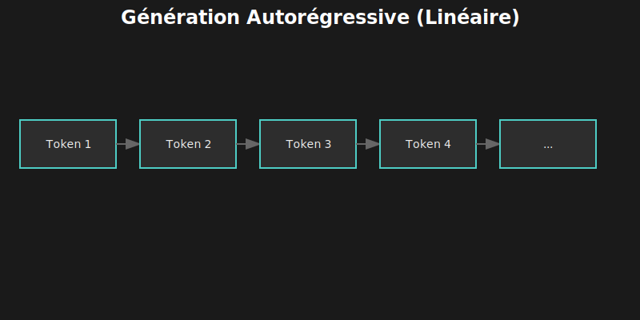
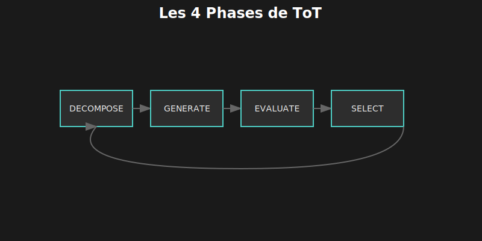
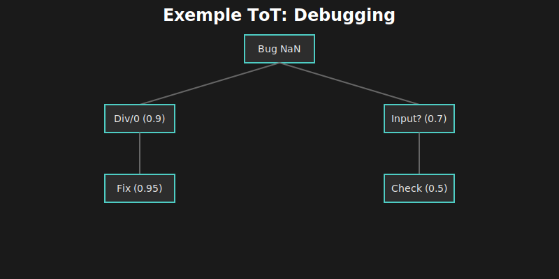
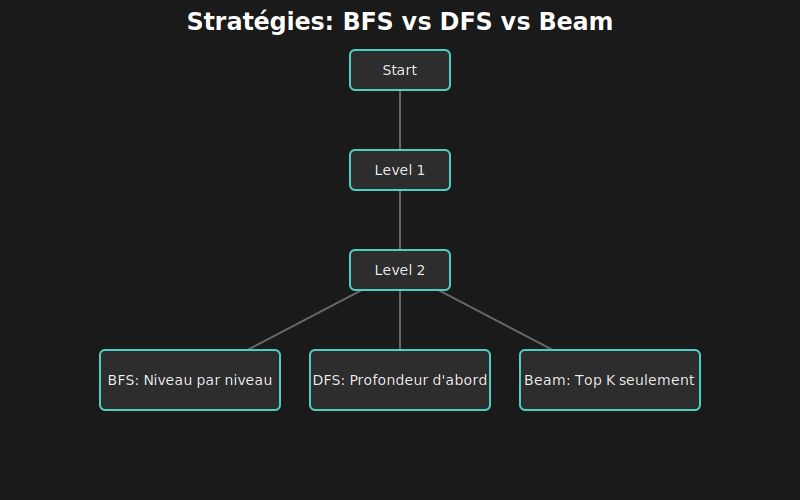

# 🌳 Chapitre 4 : Tree-of-Thought (ToT)

---

## 🎬 Scène d'ouverture : L'Impasse du Raisonnement Linéaire

*Lina fixait son écran depuis une heure. Le test échouait de manière intermittente — parfois il passait, parfois non. Son chatbot avait déjà proposé trois solutions... qui n'avaient rien résolu.*

— "C'est comme si tu tirais au hasard," soupira-t-elle en fermant la quatrième suggestion inutile.

Elle se leva et alla au tableau blanc. Comment résoudrait-elle ce problème elle-même ?

Elle commença à écrire :
- **Hypothèse 1** : Race condition ?
- **Hypothèse 2** : État partagé corrompu ?
- **Hypothèse 3** : Timing du mock ?
- **Hypothèse 4** : Fuite de mémoire entre tests ?

Puis elle nota des scores à côté de chaque hypothèse :
- Race condition : **80%** (comportement aléatoire classique)
- État partagé : **60%** (possible mais les tests sont isolés)
- Timing mock : **40%** (peu probable, les mocks sont synchrones)
- Fuite mémoire : **20%** (les tests sont courts)

Elle commença à explorer la piste de la race condition, généra des sous-hypothèses, en évalua certaines, en abandonna d'autres...

— "C'est ça," réalisa-t-elle soudain. "Je ne pense pas en ligne droite. Je pense en **arbre**. J'explore plusieurs chemins, j'évalue lesquels sont prometteurs, et j'abandonne les impasses."

Elle retourna à son code.

— "Et si je t'apprenais à faire pareil ?"

---

## 🎯 4.1 Le Problème du Raisonnement Linéaire

### 4.1.1 🔗 La Limite Fondamentale

Les LLMs génèrent du texte **token par token**, chaque token dépendant des précédents. C'est la génération autorégressive.



Si le modèle s'engage sur une mauvaise piste au token 50, il doit continuer sur cette piste jusqu'à la fin. **Pas de retour en arrière possible.**

### 4.1.2 🎮 Exemple Concret : Le Game of 24

Le **Game of 24** est un benchmark classique : utiliser quatre nombres avec +, -, ×, ÷ pour obtenir 24.


### 4.1.3 🧠 Pourquoi Ça Marche

ToT imite le raisonnement humain naturel :

| 🧠 Ce que fait l'humain | 🌳 Ce que fait ToT |
|:------------------------|:-------------------|
| "Et si j'essayais X ?" | Générer N pensées candidates |
| "Cette piste a l'air prometteuse" | Scorer chaque pensée (0-1) |
| "Je continue sur celle-ci" | Sélectionner les meilleures |
| "Non, mauvaise idée, revenons" | Élaguer et backtracker |

> 💡 **Insight clé** : Les humains ne pensent pas en ligne droite. Ils explorent, évaluent, abandonnent, recommencent. ToT donne cette capacité aux LLMs.

---

## 📐 4.2 L'Algorithme Tree-of-Thought

### 4.2.1 🏗️ Structure de Données

Chaque pensée est un **nœud** dans un arbre :

```typescript
interface ThoughtNode {
  id: string;
  content: string;           // Le contenu de cette pensée
  score: number;             // Évaluation de la promesse (0-1)
  depth: number;             // Profondeur dans l'arbre
  parent: ThoughtNode | null;
  children: ThoughtNode[];
  state: 'pending' | 'expanded' | 'pruned' | 'solution';
  metadata: {
    generatedAt: Date;
    evaluatedBy: 'self' | 'vote' | 'execution';
    confidence: number;
  };
}

interface ThoughtTree {
  root: ThoughtNode;
  problem: string;
  maxDepth: number;
  branchingFactor: number;   // Combien d'enfants par nœud
  solutions: ThoughtNode[];  // Solutions trouvées
}
```

### 4.2.2 🔄 Les Quatre Phases



1.  **Décomposer** : Casser le problème en étapes.
2.  **Générer** : Créer plusieurs options pour la prochaine étape.
3.  **Évaluer** : Juger chaque option.
4.  **Sélectionner** : Garder les meilleures et recommencer.

### 4.2.3 🌲 Visualisation d'un Arbre



---

## 🧭 4.3 Les Stratégies de Recherche

Il existe plusieurs façons de parcourir l'arbre. Le choix de la stratégie impacte fortement les résultats.

### 4.3.1 📊 Comparaison des Stratégies

| 🧭 Stratégie | 📝 Description | ✅ Avantages | ⚠️ Inconvénients |
|:-------------|:---------------|:-------------|:-----------------|
| **BFS** | Explorer tous les nœuds d'un niveau avant le suivant | Ne rate pas de solution proche | Coûteux en mémoire et appels |
| **DFS** | Explorer une branche jusqu'au bout | Économe en mémoire | Peut s'enliser dans une impasse |
| **Beam** | Garder les K meilleurs à chaque niveau | Bon compromis | Peut élaguer une bonne branche |

### 4.3.2 📐 Visualisation des Stratégies



### 4.3.5 🎯 Configuration Recommandée par Tâche

| 🎯 Type de Tâche | 🧭 Stratégie | 🌿 Branching | 📏 Depth | 📊 Beam |
|:-----------------|:-------------|:------------:|:--------:|:-------:|
| Bug simple | BFS | 3 | 2 | 3 |
| Bug complexe | Beam | 4 | 4 | 3 |
| Refactoring | DFS | 2 | 6 | 2 |
| Architecture | Beam | 5 | 3 | 4 |
| Optimisation | Beam | 4 | 5 | 3 |

---

## ⚖️ 4.4 L'Évaluation des Pensées

L'évaluation est **critique** — une mauvaise évaluation mène à de mauvaises décisions d'élagage.

### 4.4.1 📊 Trois Méthodes d'Évaluation

| 🔧 Méthode | 📝 Description | ✅ Avantages | ⚠️ Inconvénients |
|:-----------|:---------------|:-------------|:-----------------|
| **Self** | Le LLM évalue ses propres pensées | Simple, un seul appel | Biais vers ses propres idées |
| **Vote** | Plusieurs évaluations, puis moyenne | Plus robuste | Plus d'appels API |
| **Execution** | Exécuter le code et vérifier | Objectif, précis | Seulement pour le code |

### 🧪 Laboratoire : Implémenter une Auto-évaluation

Voici comment implémenter une évaluation robuste avec un LLM :

```typescript
async function selfEvaluate(thought: ThoughtNode, problem: string): Promise<number> {
  const prompt = `
    Problème original : ${problem}

    Pensée à évaluer : ${thought.content}

    Évalue cette pensée sur une échelle de 0 à 1 :
    - 0.0-0.2 : Hors sujet ou fausse
    - 0.3-0.4 : Peu prometteuse
    - 0.5-0.6 : Pertinente, mérite exploration
    - 0.7-0.8 : Prometteuse, probablement sur la bonne piste
    - 0.9-1.0 : Excellente, très probablement la solution

    Réponds UNIQUEMENT avec un nombre flottant (ex: 0.85).
  `;

  const response = await llm.complete(prompt);
  return parseFloat(response.trim());
}
```

---

## 💻 4.5 Implémentation Grok-CLI

### 4.5.1 📁 Architecture du Module

```
src/agent/reasoning/
├── index.ts                 # Point d'entrée, export
├── tree-of-thought.ts       # 🌳 Implémentation principale
├── thought-generator.ts     # 🌱 Génération de pensées
├── thought-evaluator.ts     # ⚖️ Évaluation
├── search-strategies.ts     # 🧭 BFS, DFS, Beam
├── types.ts                 # 📐 Types TypeScript
└── prompts/
    ├── decompose.ts         # Prompts de décomposition
    ├── generate.ts          # Prompts de génération
    └── evaluate.ts          # Prompts d'évaluation
```

---

## 🎬 4.6 Cas Pratiques

### 4.6.1 🐛 Cas 1 : Debugging d'une Fonction

**Problème** : "calculateDiscount retourne parfois NaN"

L'arbre généré (simplifié) :
1.  **Hypothèse NaN** (Score 0.9)
    *   **Div par 0** (Score 0.85) -> **Trouvé : `total / price`** -> **Fix : `if (price === 0)`**
    *   **Input undefined** (Score 0.7) -> Non reproduit

### 4.6.2 🏗️ Cas 2 : Refactoring d'Architecture

**Problème** : "Refactorer UserService"

L'arbre généré :
1.  **Stratégie Domaine** (Score 0.9) -> **Auth/Profile/Settings** -> **Plan Migration**
2.  **Stratégie Technique** (Score 0.6) -> Controller/Service -> Élagué

---

## ⚙️ 4.7 Optimisations et Bonnes Pratiques

### 4.7.1 📊 Réduire les Appels API

Au lieu d'évaluer chaque pensée individuellement, demandez au LLM d'évaluer une liste en une seule fois.

```typescript
// ✅ Évaluation batch : 1 appel pour N pensées
async function batchEvaluate(thoughts: ThoughtNode[], problem: string): Promise<void> {
  const prompt = `... Évalue ces ${thoughts.length} pensées ...`;
  // ...
}
```

### 4.7.2 🏃 Early Stopping

Si vous trouvez un score > 0.95, arrêtez tout et retournez la solution ! Pas besoin d'être perfectionniste si le code marche.

---

## ⚠️ 4.8 Limitations : Quand Ne Pas Utiliser ToT

ToT est puissant mais coûteux.

| Configuration | Appels max | Coût estimé |
|:--------------|:----------:|:-----------:|
| Branching=3, Depth=4 | 3⁴ = 81 | ~$0.40 |
| Branching=4, Depth=4 | 4⁴ = 256 | ~$1.30 |

> ⚠️ **Règle** : N'utilisez ToT que pour les problèmes complexes (debugging difficile, architecture). Pour "Quelle heure est-il ?", un appel direct suffit.

---

## 📝 4.9 Points Clés à Retenir

*   **ToT** permet de sortir des impasses du raisonnement linéaire.
*   **Beam Search** est souvent la meilleure stratégie pour le code (équilibre coût/qualité).
*   **L'évaluation** est l'étape la plus difficile et la plus importante.

---

| ⬅️ Précédent | 📖 Sommaire | ➡️ Suivant |
|:-------------|:-----------:|:-----------|
| [Anatomie d'un Agent](03-anatomie-agent.md) | [Index](README.md) | [Monte-Carlo Tree Search](05-mcts.md) |
