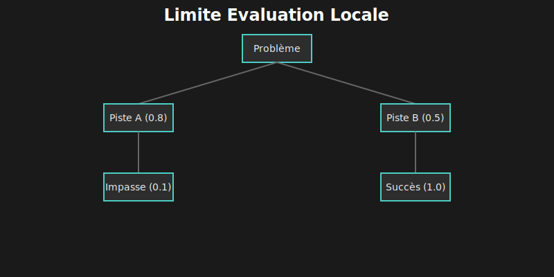
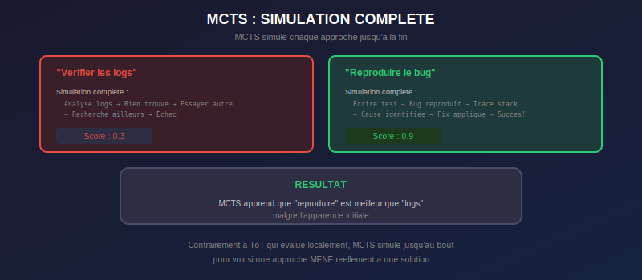
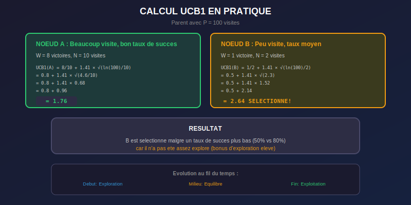
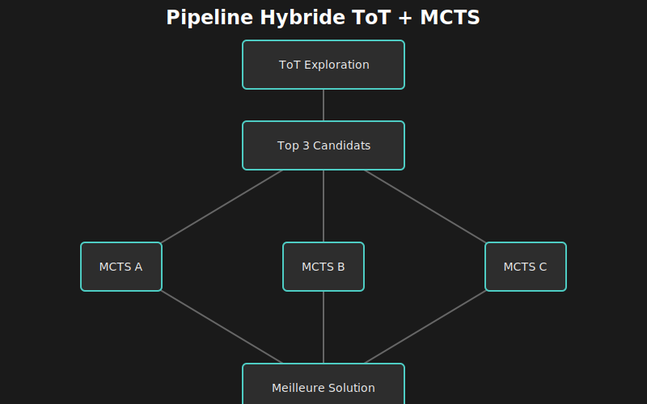
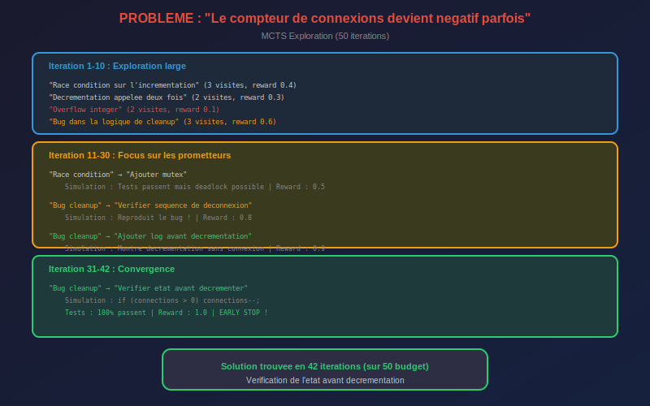
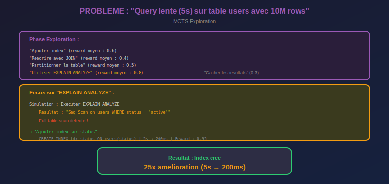
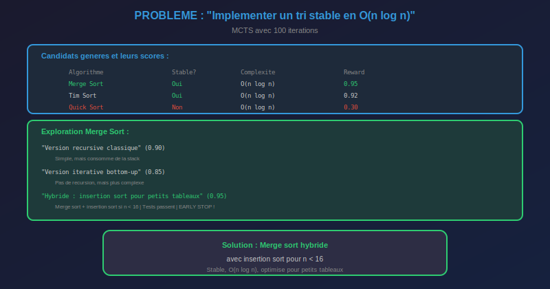

# 🎲 Chapitre 5 : Monte-Carlo Tree Search (MCTS)

---

## 🎬 Scène d'ouverture : L'Algorithme d'AlphaGo

*Vendredi matin. Lina observait les logs de son agent ToT. Les résultats étaient meilleurs qu'avant, mais quelque chose la dérangeait.*

**Lina** *(pointant l'écran)* : "Regarde ça. 87 branches explorées avant de trouver la solution. Quatre-vingt-sept."

**Marc** *(se penchant)* : "C'est beaucoup ?"

**Lina** : "La bonne piste était la troisième. Les 84 autres ? Du gaspillage. Temps, tokens, argent — tout ça pour explorer des impasses évidentes."

*Elle fit défiler les logs.*

**Lina** : "Là, il explore 'vérifier si le fichier existe'. Le fichier existe, on le sait déjà, c'est dans le contexte. Mais l'agent ne fait pas le lien."

**Marc** : "Il explore à l'aveugle."

**Lina** : "Exactement. C'est comme jouer aux échecs en testant TOUS les coups possibles. Personne ne joue comme ça."

*Elle se figea. Cette phrase venait de déclencher quelque chose.*

**Lina** *(lentement)* : "Personne... sauf les ordinateurs des années 90. Avant DeepBlue. Avant..."

**Marc** : "AlphaGo ?"

*Lina ouvrit un onglet et tapa "AlphaGo MCTS paper".*

**Lina** : "AlphaGo n'explorait pas tous les coups possibles. Avec le Go, c'est impossible — il y a plus de positions que d'atomes dans l'univers."

**Marc** : "Comment il faisait alors ?"

**Lina** *(lisant rapidement)* : "Il **simulait** des parties complètes. À partir de chaque coup possible, il jouait une partie fictive jusqu'à la fin, comptait les victoires et les défaites, et apprenait quelles stratégies fonctionnaient vraiment."

*Elle se retourna vers Marc, les yeux brillants.*

**Lina** : "Tu vois la différence ? ToT évalue localement — 'cette pensée semble bonne'. MCTS évalue globalement — 'cette pensée MÈNE à une solution'."

**Marc** : "C'est quoi MCTS exactement ?"

**Lina** : "Monte-Carlo Tree Search. L'algorithme qui a battu Lee Sedol en 2016. Qui a révolutionné l'IA de jeu."

*Elle ouvrit son IDE.*

**Lina** : "Et qui pourrait révolutionner notre agent."

---

## 🎯 5.1 Pourquoi MCTS pour les LLMs ?

### 5.1.1 ⚠️ Le Problème de l'Évaluation Locale

Tree-of-Thought évalue chaque pensée **localement** — est-ce que cette pensée semble bonne maintenant ? Mais une pensée qui semble bonne peut mener à une impasse, et vice versa.



### 5.1.2 💡 L'Intuition MCTS

Au lieu d'évaluer localement, MCTS **simule jusqu'au bout** :



### 5.1.3 🔄 Les Quatre Phases de MCTS


| Phase | Action | Objectif |
|:------|:-------|:---------|
| **1️⃣ SELECT** | Descendre avec UCB1 | Trouver le nœud le plus prometteur |
| **2️⃣ EXPAND** | Ajouter un enfant | Explorer une nouvelle direction |
| **3️⃣ SIMULATE** | Rollout complet | Estimer la qualité de ce chemin |
| **4️⃣ BACKPROP** | Remonter le score | Mettre à jour les statistiques |

---

## 📐 5.2 La Formule UCB1

### 5.2.1 ⚖️ Le Dilemme Exploration vs Exploitation

Tout algorithme de recherche doit équilibrer deux forces opposées :

| 🎯 Exploitation | 🔍 Exploration |
|:----------------|:---------------|
| Aller vers ce qu'on **sait** être bon | Essayer des chemins **peu visités** |
| Optimiser la solution actuelle | Découvrir de nouvelles possibilités |
| Risque : rester coincé dans un optimum local | Risque : perdre du temps sur des impasses |

MCTS balance les deux avec la formule **UCB1** (Upper Confidence Bound) :


### 5.2.2 🧮 Exemple de Calcul



### 5.2.3 📈 Évolution au Fil du Temps

| 📅 Phase | 🎯 Dominante | 📝 Comportement |
|:---------|:-------------|:----------------|
| **Début** (peu de visites) | Exploration | Visite beaucoup de nœuds, construit une image large |
| **Milieu** | Équilibre | Explore les prometteurs, abandonne les mauvais |
| **Fin** (beaucoup de visites) | Exploitation | Concentre sur les meilleurs, affine la solution |

---

## 🤖 5.3 Adaptation aux LLMs : RethinkMCTS

### 5.3.1 🔄 Différences avec MCTS Classique

| Aspect | 🎮 MCTS Jeux | 🤖 MCTS LLM |
|:-------|:-------------|:------------|
| **Actions** | Discrètes (coups de Go) | Continues (texte libre) |
| **Simulation** | Rapide (règles du jeu) | Lente (appel LLM) |
| **Récompense** | Victoire/défaite binaire | Qualité de la solution (0-1) |
| **État terminal** | Fin de partie | Solution trouvée ou profondeur max |
| **Coût par simulation** | ~0.001s | ~2-10s |

### 5.3.2 🎲 Le Rollout LLM

Au lieu de simuler une partie de Go, on demande au LLM de **simuler une résolution complète** :

```typescript
async function llmRollout(node: MCTSNode, problem: string): Promise<number> {
  const path = getPath(node).map(n => `→ ${n.action}`).join('\n');

  const prompt = `
    Problème : ${problem}

    Chemin actuel :
    ${path}

    Continue cette approche jusqu'à la résolution.
    Sois concis mais montre chaque étape.

    À la fin, évalue le succès :
    - 0.0-0.2 : Échec total, mauvaise direction
    - 0.3-0.5 : Partiellement résolu
    - 0.6-0.8 : Presque résolu
    - 0.9-1.0 : Complètement résolu

    SCORE: [ton score ici]
  `;

  const response = await llm.complete(prompt, { temperature: 0.7 });

  // Extraire le score
  const match = response.match(/SCORE:\s*([\d.]+)/i);
  return match ? parseFloat(match[1]) : 0.5;
}
```

### 5.3.3 ⚡ Le Rollout avec Exécution Réelle

Pour le code, on peut obtenir un feedback **objectif** en exécutant réellement :

```typescript
async function executionRollout(node: MCTSNode, context: CodeContext): Promise<number> {
  // 1. Générer le code complet basé sur le chemin
  const code = await generateCode(node, context);

  try {
    // 2. Exécuter dans une sandbox
    await sandbox.execute(code);

    // 3. Lancer les tests
    const testResult = await runTests(context.testFile);

    // 4. Score basé sur les tests passés
    if (testResult.allPassed) {
      return 1.0; // 🎯 Solution parfaite !
    }

    return testResult.passed / testResult.total;
  } catch (error) {
    // Erreur = mauvaise solution
    return 0.1;
  }
}
```

### 5.3.4 🔀 Le Rollout Hybride (Recommandé)

```typescript
async function hybridRollout(
  node: MCTSNode,
  problem: string,
  context?: CodeContext
): Promise<number> {
  // Étape 1 : Évaluation rapide par LLM
  const llmScore = await llmRollout(node, problem);

  // Étape 2 : Si prometteur ET on a des tests, vérifier pour de vrai
  if (llmScore >= 0.7 && context?.hasTests) {
    return executionRollout(node, context);
  }

  return llmScore;
}
```

| 🔧 Méthode | ⚡ Vitesse | 🎯 Précision | 📋 Cas d'usage |
|:-----------|:----------|:-------------|:---------------|
| LLM seul | Rapide (~3s) | Approximative | Exploration large |
| Exécution seule | Lente (~10s) | Objective | Validation finale |
| Hybride | Optimale | Meilleure des deux | Production |

---

## 💻 5.4 Algorithme Complet

### 5.4.1 🏗️ Structure de Données

```typescript
interface MCTSNode {
  id: string;
  action: string;           // L'action/pensée de ce nœud
  parent: MCTSNode | null;
  children: MCTSNode[];

  // 📊 Statistiques MCTS
  visits: number;           // N (nombre de visites)
  totalReward: number;      // Somme des récompenses
  meanReward: number;       // W/N (taux de succès moyen)
  bestReward: number;       // Meilleure récompense vue

  // 🏷️ Métadonnées
  depth: number;
  isTerminal: boolean;
  isFullyExpanded: boolean;
}

interface MCTSConfig {
  explorationConstant: number;  // C (default √2 ≈ 1.41)
  maxIterations: number;        // Budget de simulations
  maxDepth: number;             // Profondeur max de l'arbre
  rolloutMethod: 'llm' | 'execution' | 'hybrid';
  expansionWidth: number;       // Nombre d'enfants par expansion
  earlyStopThreshold: number;   // Score pour arrêter tôt (default 0.95)
}
```

### 5.4.2 💻 Implémentation Réelle

Voici la véritable implémentation de MCTS dans `Grok-CLI` (extraite de `src/agent/reasoning/mcts.ts`), incluant le mécanisme de **Rethink** qui permet de raffiner les pensées erronées :

```typescript
// src/agent/reasoning/mcts.ts
export class MCTS {
  async search(problem: Problem): Promise<ReasoningResult> {
    // ... initialisation ...

    // Créer la racine
    this.root = this.createNode(`Understanding the problem: ${problem.description}`, "analysis", null, 0);

    // Boucle principale MCTS
    for (let i = 0; i < this.config.maxIterations; i++) {
      this.stats.iterations = i + 1;

      // 1️⃣ SELECTION : Descente avec UCB1
      const selectedNode = this.select(this.root);

      // 2️⃣ EXPANSION
      if (selectedNode.depth < this.config.maxDepth) {
        await this.expand(selectedNode, problem);
      }

      // 3️⃣ SIMULATION & ÉVALUATION
      if (selectedNode.children.length > 0) {
        for (const child of selectedNode.children) {
          await this.simulate(child, problem);
        }
      }

      // 4️⃣ BACKPROPAGATION
      this.backpropagate(selectedNode);

      // 5️⃣ RETHINK (Nouveauté Grok-CLI)
      // Si une pensée a échoué mais semble prometteuse, on la "repense"
      if (this.config.useRethink) {
        await this.rethink(selectedNode, problem);
      }

      // Early stopping si solution excellente trouvée
      const solution = this.findBestSolution();
      if (solution && solution.score > 0.9) break;
    }

    return this.buildResult();
  }

  // Calcul UCB1 (Upper Confidence Bound)
  private calculateUCB1(node: ThoughtNode, parentVisits: number): number {
    if (node.visits === 0) return Infinity; // Exploration infinie pour les non-visités

    const exploitation = node.score / node.visits;
    const exploration = this.config.explorationConstant *
      Math.sqrt(Math.log(parentVisits) / node.visits);

    return exploitation + exploration;
  }

  // Mécanisme de Rethink
  private async rethink(node: ThoughtNode, _problem: Problem): Promise<void> {
    const nodesToRethink = this.findNodesNeedingRethink(node);

    for (const n of nodesToRethink) {
      if (n.metadata.feedback) {
        // Demander au LLM de corriger sa pensée
        const refinedContent = await this.refineThought(n, n.metadata.feedback);

        // Créer une version raffinée
        const refinedNode = this.createNode(refinedContent, n.type, n.parent, n.depth);
        refinedNode.state = "refined";

        if (n.parent) n.parent.children.push(refinedNode);
        n.state = "pruned"; // On élague l'ancienne version
      }
    }
  }
}
```

---

## 📁 5.5 Implémentation Grok-CLI

### 5.5.1 📂 Architecture du Module

```
src/agent/reasoning/
├── mcts.ts                  # 🎲 Implémentation principale
├── mcts-node.ts             # 🌳 Classe MCTSNode
├── rollout/
│   ├── llm-rollout.ts       # 🤖 Simulation par LLM
│   ├── execution-rollout.ts # ⚡ Simulation par exécution
│   └── hybrid-rollout.ts    # 🔀 Combinaison des deux
├── selection/
│   ├── ucb1.ts              # 📐 Formule UCB1 standard
│   └── puct.ts              # 🎯 Variante PUCT (style AlphaGo)
└── config.ts                # ⚙️ Configuration
```

### 5.5.2 🎯 Variante PUCT (Style AlphaGo)

AlphaGo utilise PUCT au lieu d'UCB1, avec des **prior probabilities** :

```typescript
// src/agent/reasoning/selection/puct.ts
export class PUCTSelector {
  private cPuct: number;

  constructor(cPuct: number = 1.0) {
    this.cPuct = cPuct;
  }

  select(node: MCTSNode): MCTSNode {
    let bestScore = -Infinity;
    let bestChild: MCTSNode | null = null;

    const sqrtParentVisits = Math.sqrt(node.visits);

    for (const child of node.children) {
      // PUCT inclut une prior probability P(a)
      // Pour un LLM : score initial de l'évaluation
      const prior = child.priorProbability ?? 1 / node.children.length;

      const exploitation = child.meanReward;
      const exploration = this.cPuct * prior * sqrtParentVisits / (1 + child.visits);

      const puct = exploitation + exploration;

      if (puct > bestScore) {
        bestScore = puct;
        bestChild = child;
      }
    }

    return bestChild!;
  }
}
```

| 🔧 Formule | 📐 UCB1 | 🎯 PUCT |
|:-----------|:--------|:--------|
| Prior | Non | Oui (score LLM initial) |
| Origine | Bandits manchots | AlphaGo |
| Avantage | Simple | Utilise les connaissances du LLM |

---

## 🔀 5.6 Combinaison ToT + MCTS

### 5.6.1 🎯 Quand Utiliser Quoi ?

| Situation | Recommandation | Raison |
|:----------|:---------------|:-------|
| Problème avec solution connue | 🌳 ToT | Exploration large suffisante |
| Problème ouvert/créatif | 🎲 MCTS | Besoin de simulation profonde |
| Budget API limité | 🌳 ToT | MCTS plus coûteux |
| Code avec tests | 🎲 MCTS | Feedback objectif par exécution |
| Architecture/design | 🔀 Hybride | ToT génère, MCTS évalue |

### 5.6.2 🏗️ Architecture Hybride

```typescript
// src/agent/reasoning/hybrid-reasoner.ts
export class HybridReasoner {
  private tot: TreeOfThought;
  private mcts: MonteCarloTreeSearch;

  async solve(problem: string, context: CodeContext): Promise<Solution> {
    // 📋 Phase 1 : ToT pour générer des candidats rapidement
    console.log('Phase 1: ToT exploration...');
    const candidates = await this.tot.solve(problem);

    // ⚡ Si ToT trouve une excellente solution, l'utiliser
    if (candidates[0]?.score >= 0.9) {
      console.log('✅ ToT found excellent solution, skipping MCTS');
      return candidates[0];
    }

    // 🎲 Phase 2 : MCTS pour affiner les meilleurs candidats
    console.log('Phase 2: MCTS refinement...');
    const topCandidates = candidates.slice(0, 3);

    const mctsSolutions = await Promise.all(
      topCandidates.map(candidate =>
        this.mcts.search(problem, {
          ...context,
          initialPath: candidate.path.join(' → ')
        })
      )
    );

    // 🏆 Retourner la meilleure solution MCTS
    return mctsSolutions.reduce((best, sol) =>
      sol.score > best.score ? sol : best
    );
  }
}
```



---

## 🎬 5.7 Cas Pratiques

### 5.7.1 🐛 Cas 1 : Bug de Concurrence



### 5.7.2 🗄️ Cas 2 : Optimisation SQL



### 5.7.3 🧮 Cas 3 : Génération d'Algorithme



---

## ⚙️ 5.8 Optimisations Avancées

### 5.8.1 🔀 Parallélisation des Rollouts

```typescript
async function parallelMCTS(problem: string, numWorkers: number = 4): Promise<Solution> {
  const root = createRoot(problem);

  // Diviser les itérations entre workers
  const iterationsPerWorker = Math.ceil(config.maxIterations / numWorkers);

  await Promise.all(
    Array(numWorkers).fill(null).map(async (_, workerId) => {
      for (let i = 0; i < iterationsPerWorker; i++) {
        const node = selectAndExpand(root);

        // Ajouter "virtual loss" pendant la simulation
        node.visits++;  // Évite que d'autres workers sélectionnent le même

        // Les rollouts peuvent être parallèles
        const reward = await simulate(node);

        // Backprop avec le vrai reward
        backpropagate(node, reward);
      }
    })
  );

  return extractBestPath(root);
}
```

### 5.8.2 📏 Progressive Widening

Limiter le nombre d'enfants **progressivement** selon les visites :

```typescript
function shouldExpand(node: MCTSNode, alpha: number = 0.5): boolean {
  // Formule : max_children ∝ visits^alpha
  const maxChildren = Math.ceil(Math.pow(node.visits, alpha));
  return node.children.length < maxChildren;
}

// Avec alpha = 0.5 :
// - 1 visite   → max 1 enfant
// - 4 visites  → max 2 enfants
// - 9 visites  → max 3 enfants
// - 16 visites → max 4 enfants
```

### 5.8.3 💾 Table de Transposition

Éviter de recalculer pour des **états identiques** :

```typescript
const transpositionTable = new Map<string, MCTSNode>();

function getOrCreateNode(state: string, parent: MCTSNode): MCTSNode {
  const key = hashState(state);

  if (transpositionTable.has(key)) {
    const existing = transpositionTable.get(key)!;
    existing.addParent(parent);  // DAG au lieu d'arbre
    return existing;
  }

  const node = new MCTSNode(state, parent);
  transpositionTable.set(key, node);
  return node;
}
```

---

## 📊 5.9 Métriques et Debugging

### 5.9.1 📈 Métriques Importantes

| Métrique | Description | Valeur typique |
|:---------|:------------|:---------------|
| `totalIterations` | Simulations effectuées | 50-200 |
| `nodesExpanded` | Nœuds créés | 100-500 |
| `maxDepthReached` | Profondeur max | 4-8 |
| `convergenceIteration` | Quand la solution s'est stabilisée | ~30-60% du budget |
| `explorationRatio` | % visites sur nœuds peu visités | 30-50% au début |
| `averageRolloutTime` | Temps moyen par simulation | 2-10s |

### 5.9.2 🌳 Visualisation de l'Arbre

```typescript
function visualizeTree(root: MCTSNode, maxDepth: number = 3): string {
  const lines: string[] = [];

  function traverse(node: MCTSNode, prefix: string, isLast: boolean): void {
    const connector = isLast ? '└─' : '├─';
    const stats = `[${node.visits}v, ${(node.meanReward * 100).toFixed(0)}%]`;
    const action = node.action.substring(0, 40);

    lines.push(`${prefix}${connector} ${action} ${stats}`);

    if (node.depth < maxDepth && node.children.length > 0) {
      const children = node.children.sort((a, b) => b.visits - a.visits);
      children.forEach((child, i) => {
        const extension = isLast ? '   ' : '│  ';
        traverse(child, prefix + extension, i === children.length - 1);
      });
    }
  }

  traverse(root, '', true);
  return lines.join('\n');
}
```

```
Exemple de sortie :
──────────────────
└─ Debug le bug de connexion [50v, 85%]
   ├─ Bug cleanup [35v, 92%]
   │  ├─ Vérifier état avant décrémenter [28v, 95%]
   │  └─ Ajouter logging [7v, 70%]
   └─ Race condition [12v, 40%]
      └─ Ajouter mutex [5v, 50%]
```

---

## 📝 5.10 Points Clés à Retenir

### 🎯 Sur le Problème

| Concept | Point clé |
|:--------|:----------|
| **Limite ToT** | L'évaluation locale ne prédit pas le succès final |
| **Solution MCTS** | Simuler jusqu'au bout avant de juger |
| **Inspiration** | AlphaGo a battu les humains avec MCTS |

### 📐 Sur UCB1

| Concept | Point clé |
|:--------|:----------|
| **Formule** | UCB1 = W/N + C × √(ln(P)/N) |
| **Balance** | Exploitation (W/N) + Exploration (√...) |
| **Évolution** | Exploration → Équilibre → Exploitation |

### 🔄 Sur les 4 Phases

| Phase | Action | Objectif |
|:------|:-------|:---------|
| Select | Descendre avec UCB1 | Trouver le nœud prometteur |
| Expand | Ajouter un enfant | Explorer nouvelle direction |
| Simulate | Rollout complet | Estimer la qualité |
| Backprop | Remonter le score | Mettre à jour les stats |

### 💻 Sur l'Implémentation

| Concept | Point clé |
|:--------|:----------|
| **Fichier** | `src/agent/reasoning/mcts.ts` |
| **Rollout** | LLM (rapide) ou Exécution (précis) ou Hybride |
| **Variante** | PUCT pour utiliser les priors du LLM |
| **Hybride** | ToT génère candidats → MCTS affine |

---

## 🏋️ 5.11 Exercices

### Exercice 1 : Visualisation UCB1 (30 min)

Implémentez une fonction qui affiche l'évolution des scores UCB1 au fil des itérations pour un nœud donné.

### Exercice 2 : Benchmark ToT vs MCTS (1h)

Comparez ToT vs MCTS sur 5 bugs avec tests automatisés :
- Mesurez le taux de succès
- Comptez le nombre d'itérations/appels API
- Mesurez le temps total

### Exercice 3 : PUCT avec Priors (45 min)

Implémentez PUCT où les prior probabilities sont basées sur l'évaluation LLM initiale de chaque action.

### Exercice 4 : Parallélisation (1h)

Ajoutez le support multi-thread avec virtual loss pour éviter que plusieurs workers sélectionnent le même nœud.

---

## 📚 5.12 Pour Aller Plus Loin

### Publications

- Silver, D., et al. (2016). "Mastering the game of Go with deep neural networks and tree search." Nature
- Zhang, D., et al. (2024). "RethinkMCTS: Refining Erroneous Thoughts in Monte Carlo Tree Search for Code Generation." arXiv:2404.09932

### Code Source

- Grok-CLI : `src/agent/reasoning/mcts.ts`
- UCB1 : `src/agent/reasoning/selection/ucb1.ts`
- Rollouts : `src/agent/reasoning/rollout/`

---

## 🌅 Épilogue : L'Algorithme des Champions

Lina exécuta son premier benchmark ToT vs MCTS.

```
Bug: Race condition sur compteur de connexions

ToT:  87 branches explorées, 4 solutions trouvées, 2 correctes
MCTS: 42 itérations, 1 solution trouvée, correcte

ToT time:  45s
MCTS time: 38s
```

Marc regarda les résultats par-dessus son épaule.

— "MCTS a trouvé plus vite avec moins d'exploration ?"

— "Exactement. Au lieu de tout explorer à l'aveugle, il simule chaque piste jusqu'au bout. Il **apprend** lesquelles fonctionnent vraiment."

— "Comme AlphaGo qui simule des parties entières avant de choisir un coup."

Lina hocha la tête.

— "Et le meilleur ? On peut combiner les deux. ToT pour générer rapidement des candidats, MCTS pour les affiner. Le meilleur des deux mondes."

Elle sauvegarда son code.

— "Mais on n'a pas encore fini. MCTS trouve des solutions — mais que faire quand la solution ne marche pas du premier coup ? Il faut apprendre à **réparer**."

— "ChatRepair ?"

— "ChatRepair. L'art de la réflexion et de l'auto-amélioration."

---

| ⬅️ Précédent | 📖 Sommaire | ➡️ Suivant |
|:-------------|:-----------:|:-----------|
| [Tree-of-Thought](04-tree-of-thought.md) | [Index](README.md) | [Repair et Réflexion](06-repair-reflexion.md) |
