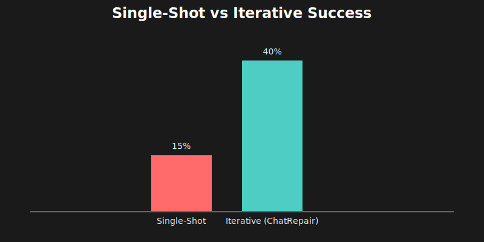
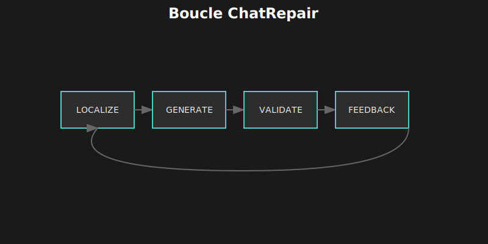
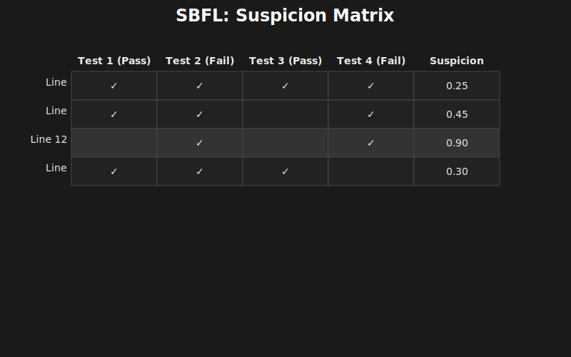

# 🔧 Chapitre 6 : Repair, Réflexion et Auto-Amélioration

---

## 🎬 Scène d'ouverture : La Cinquième Tentative Identique

*Lina observait son terminal avec un mélange de frustration et de fascination.*

L'agent venait d'échouer pour la cinquième fois sur le même bug — et, plus frustrant encore, il avait généré essentiellement le même code incorrect à chaque tentative.

— "C'est comme un étudiant qui refait exactement la même erreur à chaque examen," soupira-t-elle.

Marc se pencha par-dessus son épaule.

— "Il ne lit pas les messages d'erreur ?"

— "Techniquement, si. Mais il ne les **utilise** pas. Regarde..."

Elle pointa l'écran où s'affichaient les cinq tentatives successives :
```
Tentative 1: if (user) return user.name;  → FAIL: Cannot read property 'name'
Tentative 2: if (user) return user.name;  → FAIL: Cannot read property 'name'
Tentative 3: if (user) return user.name;  → FAIL: Cannot read property 'name'
Tentative 4: if (user) return user.name;  → FAIL: Cannot read property 'name'
Tentative 5: if (user) return user.name;  → FAIL: Cannot read property 'name'
```

— "Cinq fois le même code. Cinq fois le même échec."

— "C'est comme ça que je debuggais quand j'avais 15 ans," rit Marc. "Refaire la même chose en espérant un résultat différent."

Lina ouvrit un nouvel onglet.

— "J'ai lu un papier là-dessus. ChatRepair. Ils ont exactement le même problème, et ils ont trouvé une solution : donner au modèle un **feedback structuré** de ses erreurs. Pas juste 'ça a échoué', mais 'voici pourquoi ça a échoué, et voici ce que tu as déjà essayé'."

Elle commença à coder.

— "L'idée, c'est de créer une **boucle de réparation itérative**. Pas du réessai aveugle — de l'**apprentissage**."

---

## 📊 6.1 Le Problème de la Réparation Single-Shot

### 6.1.1 📈 Les Statistiques Qui Font Réfléchir

Sur les benchmarks standards comme SWE-bench, les résultats single-shot sont décevants :



### 6.1.2 🔄 Réessayer ≠ Réparer

Le problème n'est pas de réessayer — c'est de réessayer **intelligemment** :

```
┌─────────────────────────────────────────────────────────────────────┐
│                    ❌ MAUVAISE APPROCHE : REGENERATE                │
├─────────────────────────────────────────────────────────────────────┤
│                                                                      │
│  Essai 1 : Génère solution A → Échoue                               │
│  Essai 2 : Génère solution A' → Échoue (souvent similaire !)       │
│  Essai 3 : Génère solution A'' → Échoue                             │
│  Essai 4 : Génère solution A''' → Échoue                            │
│  ...                                                                 │
│                                                                      │
│  ⚠️ Le modèle n'a pas de feedback — il explore aléatoirement       │
│  ⚠️ Forte probabilité de retomber sur la même erreur               │
│                                                                      │
└─────────────────────────────────────────────────────────────────────┘

┌─────────────────────────────────────────────────────────────────────┐
│                    ✅ BONNE APPROCHE : REPAIR                       │
├─────────────────────────────────────────────────────────────────────┤
│                                                                      │
│  Essai 1 : Génère solution A → Échoue avec erreur E                │
│                    │                                                 │
│                    ▼                                                 │
│            Analyse E : "user existe mais name est undefined"        │
│                    │                                                 │
│                    ▼                                                 │
│  Essai 2 : Génère solution B (différente !) → Échoue avec E'       │
│                    │                                                 │
│                    ▼                                                 │
│            Analyse E' : "fallback nécessaire"                       │
│                    │                                                 │
│                    ▼                                                 │
│  Essai 3 : Corrige précisément → ✅ Succès !                        │
│                                                                      │
│  💡 Le modèle apprend de chaque échec et adapte son approche       │
│                                                                      │
└─────────────────────────────────────────────────────────────────────┘
```

> 💡 **Analogie humaine** : Quand vous debuggez, vous ne réécrivez pas aveuglément le même code. Vous lisez l'erreur, vous comprenez ce qui s'est passé, et vous ajustez votre approche. ChatRepair donne cette capacité aux LLMs.

---

## 🔄 6.2 L'Architecture ChatRepair

### 6.2.1 🏗️ Vue d'Ensemble

ChatRepair (publié à ISSTA 2024) propose une boucle de réparation guidée par les tests :



### 6.2.2 📋 Les Trois Composants Clés

| 🔧 Composant | 🎯 Rôle | ⚙️ Technique |
|:-------------|:--------|:-------------|
| **Fault Localization** | Identifier où se trouve le bug | Ochiai, DStar, coverage, stack trace |
| **Patch Generation** | Proposer un correctif | LLM avec contexte ciblé + historique |
| **Test Validation** | Vérifier le correctif | Exécution des tests, analyse des résultats |

---

## 🔍 6.3 Fault Localization : Trouver le Bug

### 6.3.1 🎯 Pourquoi C'est Crucial

La localisation précise du bug est **déterminante** pour la qualité de la réparation :

```
┌─────────────────────────────────────────────────────────────────────┐
│                    🎯 IMPACT DE LA LOCALISATION                     │
├─────────────────────────────────────────────────────────────────────┤
│                                                                      │
│  ❌ MAUVAISE LOCALISATION :                                         │
│  ─────────────────────────                                          │
│  Prompt : "Voici les 50 fichiers du projet. Trouve et corrige       │
│           le bug qui fait échouer les tests."                       │
│                                                                      │
│  Résultat :                                                         │
│  • Le modèle est noyé dans l'information                           │
│  • Il hallucine souvent des solutions                              │
│  • Taux de succès : ~10%                                           │
│                                                                      │
│  ────────────────────────────────────────────────────────────────   │
│                                                                      │
│  ✅ BONNE LOCALISATION :                                            │
│  ───────────────────────                                            │
│  Prompt : "Le bug est probablement dans calculateTotal()            │
│           fichier math.ts, ligne 45.                                │
│           Le test échoue avec 'expected 100, got NaN'.             │
│           Voici le code de la fonction et ses dépendances.         │
│           Corrige."                                                 │
│                                                                      │
│  Résultat :                                                         │
│  • Focus précis sur le code pertinent                              │
│  • Contexte suffisant pour comprendre                              │
│  • Taux de succès : ~50%                                           │
│                                                                      │
└─────────────────────────────────────────────────────────────────────┘
```

### 6.3.2 📐 Spectrum-Based Fault Localization (SBFL)

SBFL utilise la **couverture de code des tests** pour identifier les lignes suspectes :



### 6.3.3 🧮 Formules de Suspicion

Trois formules courantes pour calculer le score de suspicion :

| 🏷️ Formule | 🧮 Calcul | 📊 Caractéristique |
|:-----------|:----------|:-------------------|
| **Ochiai** | `ef / √((ef+ep) × (ef+nf))` | Bon équilibre précision/rappel |
| **DStar** | `ef² / (ep + nf)` | Haute précision, penalise les lignes passantes |
| **Tarantula** | `(ef/totalFail) / ((ef/totalFail) + (ep/totalPass))` | Équilibré, historique |

Où :
- `ef` = exécutée par tests **failed**
- `ep` = exécutée par tests **passed**
- `nf` = **non** exécutée par tests failed

```typescript
// src/agent/repair/fault-localization.ts
function ochiai(ef: number, ep: number, totalFailed: number): number {
  if (ef === 0) return 0;
  return ef / Math.sqrt((ef + ep) * totalFailed);
}

function dstar(ef: number, ep: number, nf: number, star: number = 2): number {
  const denominator = ep + nf;
  if (denominator === 0) return 0;
  return Math.pow(ef, star) / denominator;
}
```

### 6.3.4 🤖 Localisation par LLM

Quand la coverage n'est pas disponible, le LLM peut localiser :

```typescript
async function llmLocalize(
  error: string,
  stackTrace: string,
  relevantFiles: string[]
): Promise<LineSuspicion[]> {
  const prompt = `
    Tu es un expert en debugging. Analyse cette erreur.

    ## Erreur
    ${error}

    ## Stack trace
    ${stackTrace}

    ## Fichiers potentiellement concernés
    ${relevantFiles.map(f => `- ${f}`).join('\n')}

    Identifie les 3 endroits les plus probables du bug.

    Format JSON :
    [
      { "file": "...", "line": ..., "suspicion": 0.X, "reason": "..." },
      ...
    ]
  `;

  const response = await llm.complete(prompt, { temperature: 0 });
  return JSON.parse(response);
}
```

### 6.3.5 🔀 Combinaison des Techniques

En pratique, on combine plusieurs sources avec des poids :

| 📊 Source | ⚖️ Poids | 📝 Raison |
|:----------|:---------|:----------|
| Stack trace | 0.9 | Très fiable quand disponible |
| SBFL (Ochiai/DStar) | 0.8 | Objectif, basé sur les tests |
| LLM | 0.7 | Flexible, mais peut halluciner |

---

## 🔧 6.4 Patch Generation : Générer le Correctif

### 6.4.1 📋 Contexte Minimal mais Suffisant

Le secret d'une bonne génération : donner au LLM **exactement** ce dont il a besoin.

```typescript
function buildRepairContext(
  suspicion: LineSuspicion,
  error: TestError,
  codebase: Codebase
): RepairContext {
  return {
    // Le code suspect avec contexte (±10 lignes)
    suspiciousCode: codebase.getLines(
      suspicion.file,
      suspicion.line - 10,
      suspicion.line + 10
    ),

    // Types et imports pertinents
    imports: codebase.getImports(suspicion.file),
    types: codebase.getReferencedTypes(suspiciousCode),

    // Le test qui échoue
    failingTest: error.testCode,

    // L'erreur exacte
    errorMessage: error.message,

    // Tentatives précédentes (crucial !)
    previousAttempts: []
  };
}
```

### 6.4.2 📝 Prompt de Réparation

```typescript
async function generatePatch(context: RepairContext): Promise<Patch> {
  const prompt = `
Tu es un expert en correction de bugs. Corrige le bug suivant.

## Code suspect (autour de la ligne ${context.lineNumber})
\`\`\`typescript
${context.suspiciousCode}
\`\`\`

## Erreur
${context.errorMessage}

## Test qui échoue
\`\`\`typescript
${context.failingTest}
\`\`\`

${context.previousAttempts.length > 0 ? `
## ⚠️ Tentatives précédentes (ont échoué)
${context.previousAttempts.map((a, i) => `
### Tentative ${i + 1}
Patch: ${a.patch}
Résultat: ${a.error}
`).join('\n')}

⚠️ Ne répète PAS ces erreurs. Essaie une approche DIFFÉRENTE.
` : ''}

## Instructions
1. Analyse la cause root du bug
2. Propose un correctif MINIMAL
3. Ne change que ce qui est nécessaire
4. Préserve le comportement pour les autres cas

## Format de réponse
\`\`\`diff
- ligne à supprimer
+ ligne à ajouter
\`\`\`

Explication courte :
`;

  return parsePatch(await llm.complete(prompt, { temperature: 0.3 }));
}
```

### 6.4.3 📚 Templates de Réparation

Certains patterns de bugs sont **très récurrents**. Grok-CLI maintient une bibliothèque de templates :

```
┌─────────────────────────────────────────────────────────────────────┐
│                    📚 TEMPLATES DE RÉPARATION                       │
├─────────────────────────────────────────────────────────────────────┤
│                                                                      │
│  🔴 NULL/UNDEFINED CHECK                                            │
│  Pattern : /cannot read propert.*of (undefined|null)/i             │
│  Template : if (obj == null) return defaultValue;                  │
│  Confidence : 85%                                                   │
│                                                                      │
│  🔴 DIVISION BY ZERO                                                │
│  Pattern : /division by zero|NaN|Infinity/i                        │
│  Template : if (divisor === 0) throw/return;                       │
│  Confidence : 90%                                                   │
│                                                                      │
│  🔴 ARRAY INDEX OUT OF BOUNDS                                       │
│  Pattern : /index out of (bounds|range)/i                          │
│  Template : if (idx < 0 || idx >= arr.length) ...                  │
│  Confidence : 80%                                                   │
│                                                                      │
│  🔴 ASYNC/AWAIT MISSING                                             │
│  Pattern : /promise.*pending|is not a function.*then/i             │
│  Template : await asyncCall();                                     │
│  Confidence : 75%                                                   │
│                                                                      │
│  🔴 TYPE MISMATCH                                                   │
│  Pattern : /cannot.*string.*number|expected.*got/i                 │
│  Template : const converted = Type(value);                         │
│  Confidence : 70%                                                   │
│                                                                      │
└─────────────────────────────────────────────────────────────────────┘
```

```typescript
// src/agent/repair/repair-templates.ts
export const REPAIR_TEMPLATES: RepairTemplate[] = [
  {
    name: 'null_check',
    pattern: /cannot read propert.*of (undefined|null)/i,
    template: (ctx) => `if (${ctx.variable} == null) {
  return ${ctx.defaultValue ?? 'null'};
}`,
    confidence: 0.85
  },
  {
    name: 'division_guard',
    pattern: /division by zero|NaN|Infinity/i,
    template: (ctx) => `if (${ctx.divisor} === 0) {
  throw new Error('Division by zero');
}`,
    confidence: 0.90
  },
  {
    name: 'undefined_variable',
    pattern: /(\w+) is not defined/i,
    template: (ctx) => `const ${ctx.variable} = ${ctx.defaultValue ?? 'undefined'};`,
    confidence: 0.80
  },
  {
    name: 'import_error',
    pattern: /cannot find module/i,
    template: (ctx) => `import { ${ctx.symbol} } from '${ctx.module}';`,
    confidence: 0.95
  }
];
```

---

## 🔁 6.5 La Boucle de Réparation Complète

### 6.5.1 💻 Implémentation Grok-CLI

```typescript
// src/agent/repair/iterative-repair.ts
export class IterativeRepairEngine {
  private localizer: FaultLocalizer;
  private generator: PatchGenerator;
  private validator: TestValidator;
  private learning: RepairLearning;

  private maxIterations = 5;

  async repair(error: TestError, context: CodeContext): Promise<RepairResult> {
    const attempts: RepairAttempt[] = [];
    let currentError = error;

    for (let i = 0; i < this.maxIterations; i++) {
      console.log(`\n🔧 Iteration ${i + 1}/${this.maxIterations}`);

      // 1️⃣ LOCALISATION
      const suspicions = await this.localizer.localize(currentError, context);
      if (suspicions.length === 0) {
        return { success: false, reason: 'Cannot localize fault', attempts };
      }

      const topSuspicion = suspicions[0];
      console.log(`📍 Suspect: ${topSuspicion.file}:${topSuspicion.line}`);

      // 2️⃣ GÉNÉRATION
      const repairContext = this.buildContext(
        topSuspicion, currentError, context, attempts
      );

      // Vérifier les templates d'abord
      const template = findMatchingTemplate(currentError.message);
      let patch: Patch;

      if (template && template.confidence > 0.8 && i === 0) {
        patch = this.applyTemplate(template, repairContext);
        console.log(`📋 Using template: ${template.name}`);
      } else {
        patch = await this.generator.generate(repairContext);
        console.log(`🤖 Generated patch`);
      }

      // 3️⃣ APPLICATION
      const applied = await this.applyPatch(patch, context);
      if (!applied.success) {
        attempts.push({ patch, error: applied.error, iteration: i + 1 });
        continue;
      }

      // 4️⃣ VALIDATION
      const testResult = await this.validator.runTests(context.testFile);

      if (testResult.allPassed) {
        // 🎉 Succès !
        console.log(`✅ All tests pass after ${i + 1} iterations`);
        await this.learning.recordSuccess(currentError, patch);
        return { success: true, patch, iterations: i + 1, attempts };
      }

      // ❌ Échec - préparer la prochaine itération
      attempts.push({ patch, error: testResult.error, iteration: i + 1 });
      currentError = testResult.error;

      // Détecter si on tourne en rond
      if (i > 0 && this.isSameError(currentError, attempts[i - 1].error)) {
        console.log('⚠️ Same error - forcing different approach');
        repairContext.forceDifferentApproach = true;
      }
    }

    return {
      success: false,
      reason: `Max iterations (${this.maxIterations}) reached`,
      attempts
    };
  }
}
```

### 6.5.2 📋 Gestion du Feedback

Le feedback des tentatives précédentes est **crucial** :

```
┌─────────────────────────────────────────────────────────────────────┐
│                    📋 FEEDBACK STRUCTURÉ                            │
├─────────────────────────────────────────────────────────────────────┤
│                                                                      │
│  ## Tentatives précédentes (ont échoué)                             │
│                                                                      │
│  ### Tentative 1                                                    │
│  **Patch appliqué:**                                                │
│  ```diff                                                            │
│  - return user.name;                                                │
│  + if (user) return user.name;                                      │
│  ```                                                                │
│  **Résultat:** Cannot read property 'name' of undefined             │
│  **Analyse:** user existe mais est un objet vide {}                │
│                                                                      │
│  ### Tentative 2                                                    │
│  **Patch appliqué:**                                                │
│  ```diff                                                            │
│  - if (user) return user.name;                                      │
│  + if (user && user.name) return user.name;                        │
│  ```                                                                │
│  **Résultat:** Returns undefined instead of fallback               │
│  **Analyse:** Manque une valeur par défaut                         │
│                                                                      │
│  ⚠️ Important: Ne répète PAS les mêmes erreurs.                    │
│  Essaie une approche DIFFÉRENTE basée sur les analyses.            │
│                                                                      │
└─────────────────────────────────────────────────────────────────────┘
```

---

## 📚 6.6 Apprentissage des Patterns de Réparation

### 6.6.1 💾 Mémoriser Ce Qui Fonctionne

Grok-CLI mémorise les patterns de réparation qui fonctionnent :

```typescript
// src/learning/repair-learning.ts
export class RepairLearning {
  async recordSuccess(error: TestError, patch: Patch): Promise<void> {
    const errorPattern = this.extractPattern(error.message);
    const solutionPattern = this.extractSolutionPattern(patch);

    // Mettre à jour ou créer l'entrée
    await this.db.run(`
      INSERT INTO repair_learning
        (error_pattern, solution_pattern, success_count)
      VALUES (?, ?, 1)
      ON CONFLICT(error_pattern, solution_pattern)
      DO UPDATE SET success_count = success_count + 1
    `, [errorPattern, solutionPattern]);
  }

  async findSimilarFixes(error: TestError): Promise<SimilarFix[]> {
    const pattern = this.extractPattern(error.message);

    return this.db.all(`
      SELECT solution_pattern, success_count, failure_count,
             (success_count * 1.0 / (success_count + failure_count + 1)) as confidence
      FROM repair_learning
      WHERE error_pattern LIKE ?
      ORDER BY confidence DESC
      LIMIT 5
    `, [`%${pattern}%`]);
  }
}
```

### 6.6.2 📊 Table d'Apprentissage

```sql
CREATE TABLE repair_learning (
  id INTEGER PRIMARY KEY,
  error_pattern TEXT NOT NULL,      -- Pattern normalisé de l'erreur
  solution_pattern TEXT NOT NULL,   -- Type de solution (null_check, await, etc.)
  success_count INTEGER DEFAULT 0,
  failure_count INTEGER DEFAULT 0,
  created_at DATETIME DEFAULT CURRENT_TIMESTAMP,
  last_used DATETIME,

  -- Confidence calculée automatiquement
  confidence REAL GENERATED ALWAYS AS (
    success_count * 1.0 / (success_count + failure_count + 1)
  )
);

-- Index pour recherche rapide
CREATE INDEX idx_error_pattern ON repair_learning(error_pattern);
```

### 6.6.3 🏷️ Extraction des Patterns

```typescript
private extractSolutionPattern(patch: Patch): string {
  const patterns: string[] = [];
  const diff = patch.diff;

  if (diff.includes('if') && diff.includes('null')) patterns.push('null_check');
  if (diff.includes('try') && diff.includes('catch')) patterns.push('try_catch');
  if (diff.includes('await')) patterns.push('add_await');
  if (diff.includes('?.')) patterns.push('optional_chaining');
  if (diff.includes('??')) patterns.push('nullish_coalescing');
  if (diff.includes('Array.isArray')) patterns.push('array_check');
  if (diff.includes('typeof')) patterns.push('type_check');

  return patterns.join(',') || 'custom';
}
```

---

## 🤔 6.7 Réflexion et Self-Improvement

### 6.7.1 🔍 Auto-Analyse des Échecs

Quand la réparation échoue complètement, l'agent peut analyser **pourquoi** :

```typescript
async function analyzeRepairFailure(
  attempts: RepairAttempt[],
  context: CodeContext
): Promise<FailureAnalysis> {
  const prompt = `
    Tu es un expert en debugging. Analyse pourquoi ces tentatives ont échoué.

    ## Bug original
    ${context.originalError}

    ## Tentatives de réparation
    ${attempts.map((a, i) => `
    Tentative ${i + 1}:
    Patch: ${a.patch.diff}
    Résultat: ${a.error.message}
    `).join('\n---\n')}

    ## Questions à analyser
    1. Quel est le vrai problème sous-jacent ?
    2. Pourquoi chaque tentative a-t-elle échoué ?
    3. Qu'est-ce qui aurait dû être fait différemment ?
    4. Y a-t-il un pattern commun dans les échecs ?

    ## Format JSON
    {
      "rootCause": "...",
      "attemptAnalysis": [{ "attempt": 1, "whyFailed": "..." }, ...],
      "betterApproach": "...",
      "lessonsLearned": ["...", "..."]
    }
  `;

  return JSON.parse(await llm.complete(prompt, { temperature: 0 }));
}
```

### 6.7.2 📈 Méta-Apprentissage

L'agent peut apprendre **quelles stratégies** fonctionnent le mieux :

```typescript
// src/learning/meta-learning.ts
export class MetaLearning {
  async updateStrategyStats(
    strategy: string,
    bugType: string,
    success: boolean,
    iterations: number
  ): Promise<void> {
    await this.db.run(`
      INSERT INTO strategy_stats
        (strategy, bug_type, success, iterations, timestamp)
      VALUES (?, ?, ?, ?, datetime('now'))
    `, [strategy, bugType, success ? 1 : 0, iterations]);
  }

  async getBestStrategy(bugType: string): Promise<StrategyStats | null> {
    return this.db.get(`
      SELECT strategy,
             AVG(success) as success_rate,
             AVG(iterations) as avg_iterations
      FROM strategy_stats
      WHERE bug_type = ?
      GROUP BY strategy
      HAVING COUNT(*) >= 5
      ORDER BY success_rate DESC, avg_iterations ASC
      LIMIT 1
    `, [bugType]);
  }
}
```

---

## 🎬 6.8 Cas Pratiques

### 6.8.1 🐛 Cas 1 : Null Pointer Exception

```
┌─────────────────────────────────────────────────────────────────────┐
│  🐛 BUG : TypeError: Cannot read property 'name' of undefined       │
├─────────────────────────────────────────────────────────────────────┤
│                                                                      │
│  Itération 1                                                        │
│  ───────────                                                        │
│  📍 Localisation : user.name (ligne 42)                             │
│  🔧 Patch : if (user) return user.name;                            │
│  🧪 Test : FAIL - user.name toujours undefined quand user = {}     │
│                                                                      │
│  📝 Feedback : "user existe mais est un objet vide"                 │
│                                                                      │
│  Itération 2                                                        │
│  ───────────                                                        │
│  📍 Localisation : même endroit                                     │
│  🔧 Patch : return user?.name ?? 'Unknown';                        │
│  🧪 Test : PASS ✅                                                  │
│                                                                      │
│  📚 Apprentissage :                                                 │
│     "Cannot read property X of undefined"                          │
│     → "optional_chaining + nullish_coalescing"                     │
│                                                                      │
└─────────────────────────────────────────────────────────────────────┘
```

### 6.8.2 🔄 Cas 2 : Race Condition

```
┌─────────────────────────────────────────────────────────────────────┐
│  🔄 BUG : Parfois counter devient négatif                           │
├─────────────────────────────────────────────────────────────────────┤
│                                                                      │
│  Itération 1                                                        │
│  ───────────                                                        │
│  📍 Localisation : counter-- (ligne 78)                             │
│  🔧 Patch : counter = Math.max(0, counter - 1);                    │
│  🧪 Test : FAIL - masque le problème mais ne le résout pas         │
│                                                                      │
│  📝 Feedback : "Le vrai problème est la race condition"             │
│                                                                      │
│  Itération 2                                                        │
│  ───────────                                                        │
│  🔧 Patch : Ajout d'un mutex autour de counter                     │
│  🧪 Test : FAIL - deadlock dans certains cas                       │
│                                                                      │
│  📝 Feedback : "Mutex trop agressif, blocage possible"              │
│                                                                      │
│  Itération 3                                                        │
│  ───────────                                                        │
│  🔧 Patch : Utiliser Atomics.sub() ou compareAndSet                │
│  🧪 Test : PASS ✅                                                  │
│                                                                      │
│  📚 Apprentissage :                                                 │
│     "Race condition on counter"                                    │
│     → "atomic_operations"                                          │
│                                                                      │
└─────────────────────────────────────────────────────────────────────┘
```

### 6.8.3 ⏳ Cas 3 : Async/Await Manquant

```
┌─────────────────────────────────────────────────────────────────────┐
│  ⏳ BUG : Promise { <pending> } instead of value                    │
├─────────────────────────────────────────────────────────────────────┤
│                                                                      │
│  Itération 1                                                        │
│  ───────────                                                        │
│  📍 Localisation : const result = fetchData() (ligne 23)           │
│  🔧 Patch : const result = await fetchData();                      │
│  🧪 Test : FAIL - fonction appelante n'est pas async               │
│                                                                      │
│  📝 Feedback : "Besoin de propager async"                           │
│                                                                      │
│  Itération 2                                                        │
│  ───────────                                                        │
│  🔧 Patch : async function caller() { await fetchData(); }         │
│  🧪 Test : FAIL - caller() pas await dans le test                  │
│                                                                      │
│  📝 Feedback : "Cascade d'async jusqu'au test"                      │
│                                                                      │
│  Itération 3                                                        │
│  ───────────                                                        │
│  🔧 Patch : + await sur tous les appels de la chaîne               │
│  🧪 Test : PASS ✅                                                  │
│                                                                      │
│  📚 Apprentissage :                                                 │
│     "Promise pending"                                              │
│     → "async_cascade"                                              │
│                                                                      │
└─────────────────────────────────────────────────────────────────────┘
```

---

## 📊 6.9 Métriques et Dashboard

### 6.9.1 📈 Métriques de Réparation

| 📊 Catégorie | Métrique | Description |
|:-------------|:---------|:------------|
| **Efficacité** | `successRate` | % de bugs corrigés |
| | `avgIterations` | Moyenne d'itérations |
| | `firstTrySuccessRate` | % corrigés du premier coup |
| **Qualité** | `regressionRate` | % de correctifs qui cassent autre chose |
| | `minimalPatchRate` | % de patches minimaux |
| **Efficience** | `avgLocalizationTime` | Temps moyen de localisation |
| | `avgGenerationTime` | Temps moyen de génération |
| | `apiCallsPerRepair` | Appels LLM par réparation |

### 6.9.2 🖥️ Dashboard

```
┌─────────────────────────────────────────────────────────────────────┐
│                    🔧 REPAIR DASHBOARD                              │
├─────────────────────────────────────────────────────────────────────┤
│                                                                      │
│  📈 EFFICACITÉ                                                      │
│  ├─ Success Rate      : 42.5%                                      │
│  ├─ First-try Success : 18.2%                                      │
│  └─ Avg Iterations    : 2.3                                        │
│                                                                      │
│  ✅ QUALITÉ                                                         │
│  ├─ Regression Rate   : 5.1%                                       │
│  └─ Minimal Patches   : 78.9%                                      │
│                                                                      │
│  ⚡ EFFICIENCE                                                      │
│  ├─ Localization Time : 420ms                                      │
│  ├─ Generation Time   : 3200ms                                     │
│  └─ API Calls/Repair  : 4.2                                        │
│                                                                      │
│  📚 TOP PATTERNS APPRIS                                             │
│  ├─ null_check         : 89% confidence (142 uses)                 │
│  ├─ optional_chaining  : 85% confidence (98 uses)                  │
│  ├─ add_await          : 76% confidence (67 uses)                  │
│  └─ try_catch          : 71% confidence (45 uses)                  │
│                                                                      │
└─────────────────────────────────────────────────────────────────────┘
```

---

## 📝 6.10 Points Clés à Retenir

### 🎯 Sur le Problème

| Concept | Point clé |
|:--------|:----------|
| **Single-shot** | ~15% de succès seulement |
| **Réessayer aveuglément** | Ne fonctionne pas, même erreur répétée |
| **Itératif avec feedback** | ~40% de succès (+167%) |

### 🔄 Sur ChatRepair

| Concept | Point clé |
|:--------|:----------|
| **4 phases** | Localiser → Générer → Valider → Feedback |
| **Max 5 itérations** | Rendements décroissants au-delà |
| **Feedback structuré** | Crucial pour éviter les répétitions |

### 🔍 Sur la Localisation

| Concept | Point clé |
|:--------|:----------|
| **SBFL** | Ochiai, DStar basés sur la coverage |
| **Stack trace** | Source la plus fiable |
| **Combinaison** | Stack + SBFL + LLM pour robustesse |

### 📚 Sur l'Apprentissage

| Concept | Point clé |
|:--------|:----------|
| **Patterns** | Mémoriser ce qui fonctionne |
| **Templates** | Accélérer les bugs récurrents |
| **Méta-learning** | Savoir quelle stratégie utiliser |

---

## 🏋️ 6.11 Exercices

### Exercice 1 : Formule Tarantula (30 min)

Implémentez la formule Tarantula et comparez avec Ochiai sur 10 bugs de votre codebase.

### Exercice 2 : Nouveaux Templates (45 min)

Ajoutez 5 nouveaux templates de réparation pour des erreurs courantes dans TypeScript :
- Off-by-one error
- Missing return statement
- Wrong operator (== vs ===)
- Missing dependency in useEffect
- Incorrect regex

### Exercice 3 : Métriques (30 min)

Instrumentez le repair engine pour collecter les métriques et générez un rapport HTML.

### Exercice 4 : Analyse d'Apprentissage (1h)

Après 50 réparations, analysez la table `repair_learning` :
- Quels patterns émergent ?
- Quels sont les plus fiables ?
- Y a-t-il des patterns qui échouent souvent ?

---

## 📚 6.12 Pour Aller Plus Loin

### Publications

- Xia, C., et al. (2024). "ChatRepair: Autonomous Program Repair with ChatGPT." ISSTA 2024
- Wong, W. E., et al. (2016). "A Survey on Software Fault Localization." TSE
- Le Goues, C., et al. (2019). "Automated Program Repair." Communications of the ACM

### Code Source

- Grok-CLI : `src/agent/repair/`
- Localisation : `src/agent/repair/fault-localization.ts`
- Templates : `src/agent/repair/repair-templates.ts`
- Learning : `src/learning/repair-learning.ts`

---

## 🌅 Épilogue : Le Bug Enfin Corrigé

Lina lança la nouvelle version de son agent sur le même bug qui l'avait fait échouer cinq fois.

```
🔧 Iteration 1/5
📍 Suspect: src/utils/user.ts:42
📋 Using template: null_check
🧪 Test: FAIL - user exists but is empty object

🔧 Iteration 2/5
📍 Suspect: src/utils/user.ts:42
🤖 Generated patch (different from attempt 1)
🧪 Test: PASS ✅

✅ All tests pass after 2 iterations
📚 Learned: "Cannot read property 'name'" → "optional_chaining,nullish_coalescing"
```

Marc regarda par-dessus son épaule.

— "Deux essais au lieu de cinq identiques ?"

— "Et la deuxième tentative était **différente** de la première. C'est ça la clé — il a **appris** de l'échec au lieu de répéter la même erreur."

Elle pointa l'écran.

— "Et regarde ici : il a mémorisé le pattern. La prochaine fois qu'il verra cette erreur, il saura quoi faire."

Marc hocha la tête, impressionné.

— "OK. Tu m'as convaincu. Et maintenant ?"

Lina ferma la fenêtre de l'agent.

— "Maintenant, on passe à la mémoire. RAG, embeddings, context compression. Comment donner à l'agent une vraie compréhension du codebase."

---

*Fin de la Partie II — Raisonnement et Planification*

---

| ⬅️ Précédent | 📖 Sommaire | ➡️ Suivant |
|:-------------|:-----------:|:-----------|
| [Monte-Carlo Tree Search](05-mcts.md) | [Index](README.md) | [RAG Moderne](07-rag-moderne.md) |
