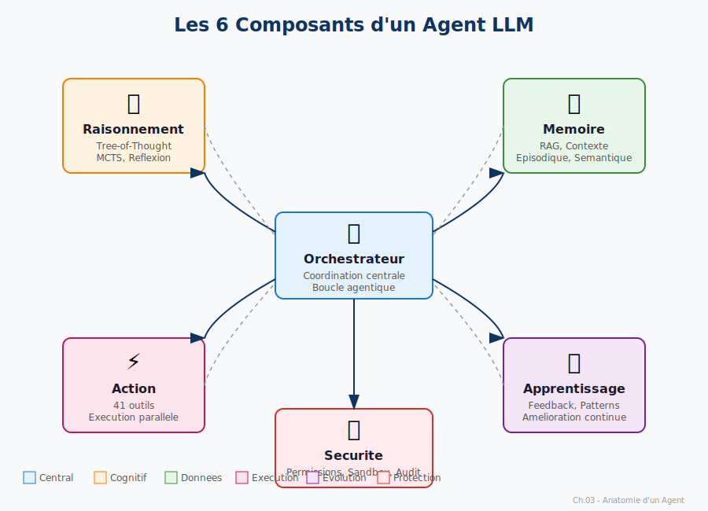

# Plan d'Amélioration Exhaustif du Livre

**"Construire un Agent LLM Moderne — De la Théorie à Grok-CLI"**

> Document de travail : plan structuré et actionnable pour améliorer le livre

---

## Table des Matières

1. [Synthèse de l'Analyse](#1-synthèse-de-lanalyse)
2. [Schémas à Créer](#2-schémas-à-créer)
3. [Exemples Concrets à Ajouter](#3-exemples-concrets-à-ajouter)
4. [Encadrés Pédagogiques](#4-encadrés-pédagogiques)
5. [Amélioration de l'Avant-propos](#5-amélioration-de-lavant-propos)
6. [Cohérence Terminologique](#6-cohérence-terminologique)
7. [Résumés de Chapitre](#7-résumés-de-chapitre)
8. [Tableaux Synthétiques par Chapitre](#8-tableaux-synthétiques-par-chapitre)
9. [Sections "Limites & Risques"](#9-sections-limites--risques)
10. [Section "Perspectives Futures"](#10-section-perspectives-futures)
11. [Préparation à la Publication](#11-préparation-à-la-publication)
12. [Commandes d'Implémentation](#12-commandes-dimplémentation)

---

## 1. Synthèse de l'Analyse

### 1.1 Points Forts Actuels

| Aspect | Évaluation | Commentaire |
|--------|:----------:|-------------|
| Structure narrative | ⭐⭐⭐⭐⭐ | Personnages Lina/Marc engageants, dialogues vivants |
| Contenu technique | ⭐⭐⭐⭐⭐ | Profondeur excellente, code fonctionnel |
| Références scientifiques | ⭐⭐⭐⭐⭐ | Papers récents (2023-2024) bien intégrés |
| Organisation | ⭐⭐⭐⭐ | Progression logique, chapitres bien délimités |
| Exercices | ⭐⭐⭐⭐ | Présents dans chaque chapitre |

### 1.2 Points à Améliorer

| Aspect | Priorité | Action Requise |
|--------|:--------:|----------------|
| Schémas | 🔴 Haute | Créer SVG pour concepts clés |
| Avant-propos | 🔴 Haute | Réécrire plus personnel/motivant |
| Sections "Limites" | 🟠 Moyenne | Ajouter dans 6 chapitres |
| Encadrés pédagogiques | 🟠 Moyenne | Standardiser et enrichir |
| Cohérence terminologique | 🟡 Basse | Glossaire + révision |
| Publication PDF/EPUB | 🟠 Moyenne | Templates + CSS |

### 1.3 Architecture Actuelle du Livre

```
docs/livre/
├── 00-avant-propos.md          (2,500 mots)
├── 01-comprendre-les-llms.md   (5,200 mots)
├── 02-role-des-agents.md       (4,800 mots)
├── 03-anatomie-agent.md        (5,500 mots)
├── 04-tree-of-thought.md       (6,100 mots)
├── 05-mcts.md                  (5,900 mots)
├── 06-repair-reflexion.md      (5,400 mots)
├── 07-rag-moderne.md           (6,300 mots)
├── 08-dependency-aware-rag.md  (5,100 mots)
├── 09-context-compression.md   (5,600 mots)
├── 10-tool-use.md              (6,800 mots)
├── 11-plugins-mcp.md           (5,700 mots)
├── 12-optimisations-cognitives.md (7,200 mots)
├── 13-optimisations-systeme.md    (7,400 mots)
├── 14-apprentissage-persistant.md (6,900 mots)
├── 15-architecture-complete.md    (8,100 mots)
├── 16-system-prompts-securite.md  (4,200 mots)
├── glossaire.md                (2,100 mots)
├── bibliographie.md            (1,800 mots)
└── index.md                    (2,400 mots)

Total estimé : ~65,000 mots (~200 pages imprimées)
```

---

## 2. Schémas à Créer

### 2.1 Liste Complète des Schémas Requis

#### Chapitre 01 — Comprendre les LLMs

| ID | Schéma | Description | Format |
|----|--------|-------------|--------|
| 01-1 | `transformer-architecture.svg` | Architecture Transformer complète avec encoder/decoder | SVG |
| 01-2 | `self-attention-mechanism.svg` | Mécanisme Q/K/V avec matrices et attention scores | SVG |
| 01-3 | `tokenization-pipeline.svg` | Flux texte → BPE → tokens → IDs | SVG |
| 01-4 | `autoregressive-generation.svg` | Génération token par token avec boucle | SVG |
| 01-5 | `context-window-limit.svg` | Fenêtre de contexte et troncature | SVG |

#### Chapitre 02 — Le Rôle des Agents

| ID | Schéma | Description | Format |
|----|--------|-------------|--------|
| 02-1 | `agent-taxonomy.svg` | Pyramide Chatbot → Assistant → Agent → Multi-Agent | SVG |
| 02-2 | `agent-capabilities-matrix.svg` | Tableau comparatif des capacités | SVG |
| 02-3 | `human-agent-interaction.svg` | Flux d'interaction utilisateur ↔ agent | SVG |

#### Chapitre 03 — Anatomie d'un Agent

| ID | Schéma | Description | Format |
|----|--------|-------------|--------|
| 03-1 | `agent-6-components.svg` | Les 6 composants (Orchestrateur, Raisonnement...) | SVG |
| 03-2 | `agentic-loop.svg` | Boucle Perceive → Reason → Act → Learn | SVG |
| 03-3 | `react-pattern.svg` | Pattern ReAct avec exemple concret | SVG |

#### Chapitre 04 — Tree-of-Thought

| ID | Schéma | Description | Format |
|----|--------|-------------|--------|
| 04-1 | `cot-vs-tot.svg` | Comparaison Chain-of-Thought vs Tree-of-Thought | SVG |
| 04-2 | `bfs-vs-dfs-tree.svg` | Arbres BFS et DFS côte à côte | SVG |
| 04-3 | `thought-evaluation.svg` | Scoring des branches avec pruning | SVG |
| 04-4 | `think-megathink-ultrathink.svg` | Budget tokens par niveau de réflexion | SVG |

#### Chapitre 05 — MCTS

| ID | Schéma | Description | Format |
|----|--------|-------------|--------|
| 05-1 | `mcts-4-phases.svg` | Select → Expand → Simulate → Backpropagate | SVG |
| 05-2 | `ucb1-formula.svg` | Formule UCB1 avec explication visuelle | SVG |
| 05-3 | `alphago-vs-agent.svg` | Analogie AlphaGo ↔ Agent de code | SVG |
| 05-4 | `mcts-iteration-example.svg` | Une itération complète pas à pas | SVG |

#### Chapitre 06 — Repair et Réflexion

| ID | Schéma | Description | Format |
|----|--------|-------------|--------|
| 06-1 | `chatrepair-loop.svg` | Boucle Generate → Test → Analyze → Refine | SVG |
| 06-2 | `sbfl-localization.svg` | Localisation de fautes avec spectre | SVG |
| 06-3 | `repair-success-funnel.svg` | Entonnoir des tentatives de réparation | SVG |

#### Chapitre 07 — RAG Moderne

| ID | Schéma | Description | Format |
|----|--------|-------------|--------|
| 07-1 | `rag-pipeline-complete.svg` | Pipeline complet : Query → Embed → Retrieve → Rerank → Generate | SVG |
| 07-2 | `embedding-space.svg` | Espace vectoriel 2D avec clusters | SVG |
| 07-3 | `chunking-strategies.svg` | Fixe vs AST vs Sémantique | SVG |
| 07-4 | `hybrid-search.svg` | BM25 + Dense combinés | SVG |

#### Chapitre 08 — Dependency-Aware RAG

| ID | Schéma | Description | Format |
|----|--------|-------------|--------|
| 08-1 | `dependency-graph.svg` | Graphe d'imports d'un projet TypeScript | SVG |
| 08-2 | `context-expansion-bfs.svg` | Expansion BFS depuis un fichier focal | SVG |
| 08-3 | `coderag-vs-naive.svg` | Comparaison contexte naïf vs enrichi | SVG |

#### Chapitre 09 — Compression de Contexte

| ID | Schéma | Description | Format |
|----|--------|-------------|--------|
| 09-1 | `lost-in-middle.svg` | Phénomène "Lost in the Middle" de Stanford | SVG |
| 09-2 | `priority-pyramid.svg` | 5 niveaux de priorité (CRITICAL → NOISE) | SVG |
| 09-3 | `observation-masking.svg` | Filtrage des outputs d'outils | SVG |
| 09-4 | `compression-before-after.svg` | Contexte avant/après compression | SVG |

#### Chapitre 10 — Tool-Use

| ID | Schéma | Description | Format |
|----|--------|-------------|--------|
| 10-1 | `tool-calling-flow.svg` | Flux complet : LLM → Tool Call → Validation → Execute → Return | SVG |
| 10-2 | `41-tools-categories.svg` | Organisation des 41 outils par catégorie | SVG |
| 10-3 | `parallel-vs-sequential.svg` | Exécution parallèle vs séquentielle | SVG |
| 10-4 | `confirmation-dialog.svg` | Interface de confirmation utilisateur | SVG |

#### Chapitre 11 — Plugins et MCP

| ID | Schéma | Description | Format |
|----|--------|-------------|--------|
| 11-1 | `mcp-architecture.svg` | Architecture MCP : Host ↔ Transport ↔ Server | SVG |
| 11-2 | `plugin-manifest.svg` | Structure d'un manifest.json | SVG |
| 11-3 | `transport-comparison.svg` | Stdio vs HTTP vs WebSocket | SVG |
| 11-4 | `plugin-sandbox.svg` | Isolation et permissions | SVG |

#### Chapitre 12 — Optimisations Cognitives

| ID | Schéma | Description | Format |
|----|--------|-------------|--------|
| 12-1 | `semantic-cache-flow.svg` | Query → Embed → Similarity → Hit/Miss | SVG |
| 12-2 | `68-percent-redundancy.svg` | Analyse des 68% de requêtes similaires | SVG |
| 12-3 | `lru-eviction.svg` | Stratégie d'éviction LRU pondérée | SVG |
| 12-4 | `cache-invalidation.svg` | Patterns d'invalidation | SVG |

#### Chapitre 13 — Optimisations Système

| ID | Schéma | Description | Format |
|----|--------|-------------|--------|
| 13-1 | `frugalgpt-routing.svg` | Routage vers le modèle optimal | SVG |
| 13-2 | `llmcompiler-dag.svg` | DAG de dépendances pour parallélisation | SVG |
| 13-3 | `lazy-loading-timeline.svg` | Timeline de chargement différé | SVG |
| 13-4 | `less-is-more.svg` | Impact du filtrage d'outils | SVG |

#### Chapitre 14 — Apprentissage Persistant

| ID | Schéma | Description | Format |
|----|--------|-------------|--------|
| 14-1 | `memgpt-os-analogy.svg` | Analogie MemGPT / Système d'exploitation | SVG |
| 14-2 | `4-memory-types.svg` | Épisodique, Sémantique, Procédurale, Prospective | SVG |
| 14-3 | `memory-consolidation.svg` | Processus de consolidation | SVG |
| 14-4 | `learning-cycle.svg` | Cycle Observer → Apprendre → Rappeler | SVG |

#### Chapitre 15 — Architecture Complète

| ID | Schéma | Description | Format |
|----|--------|-------------|--------|
| 15-1 | `6-layers-architecture.svg` | Les 6 couches de Grok-CLI | SVG |
| 15-2 | `complete-data-flow.svg` | Flux de données complet | SVG |
| 15-3 | `grok-agent-internals.svg` | Structure interne de GrokAgent | SVG |
| 15-4 | `security-layers.svg` | Les 4 couches de sécurité | SVG |

#### Chapitre 16 — System Prompts et Sécurité

| ID | Schéma | Description | Format |
|----|--------|-------------|--------|
| 16-1 | `prompt-injection-types.svg` | Direct, Indirect, Jailbreak | SVG |
| 16-2 | `defense-in-depth.svg` | 4 couches de défense | SVG |
| 16-3 | `security-flow.svg` | Flux de validation sécurité | SVG |

### 2.2 Template de Création SVG

```xml
<?xml version="1.0" encoding="UTF-8"?>
<svg xmlns="http://www.w3.org/2000/svg" viewBox="0 0 800 600">
  <defs>
    <!-- Couleurs du thème -->
    <style>
      .bg { fill: #1a1a2e; }
      .box { fill: #16213e; stroke: #0f3460; stroke-width: 2; }
      .highlight { fill: #e94560; }
      .text { fill: #eaeaea; font-family: 'Inter', sans-serif; }
      .arrow { stroke: #0f3460; stroke-width: 2; marker-end: url(#arrowhead); }
    </style>
    <marker id="arrowhead" markerWidth="10" markerHeight="7" refX="9" refY="3.5" orient="auto">
      <polygon points="0 0, 10 3.5, 0 7" fill="#0f3460"/>
    </marker>
  </defs>
  <!-- Contenu du schéma -->
</svg>
```

### 2.3 Priorité de Création

| Priorité | Schémas | Chapitres |
|:--------:|---------|-----------|
| 🔴 P0 | 03-1, 04-1, 05-1, 07-1, 15-1 | Fondamentaux |
| 🟠 P1 | 06-1, 10-1, 12-1, 13-1, 14-1 | Techniques clés |
| 🟡 P2 | Tous les autres | Enrichissement |

---

## 3. Exemples Concrets à Ajouter

### 3.1 Exemples "Avant/Après" par Chapitre

#### Chapitre 04 — Tree-of-Thought

```markdown
### Exemple : Résoudre un Bug de Performance

**Problème** : La fonction `processOrders()` prend 30s pour 1000 commandes.

**❌ Approche CoT (linéaire)** :
```
Pensée 1: C'est probablement une boucle N² → Je vérifie les boucles
Pensée 2: Non, pas de N² → Peut-être les requêtes DB ?
Pensée 3: Oui, 1000 requêtes DB → Solution : batch
Fin.
```

**✅ Approche ToT (arborescente)** :
```
                    [Bug perf]
                        │
          ┌─────────────┼─────────────┐
          ▼             ▼             ▼
    [Algorithmique] [I/O Database] [Memory]
     Score: 0.3     Score: 0.8     Score: 0.2
                        │
              ┌─────────┼─────────┐
              ▼         ▼         ▼
          [N+1]    [No Index]  [Pool]
         Score:0.9  Score:0.4  Score:0.3
              │
              ▼
        [Batch queries]
         ✓ Solution
```

**Résultat** : ToT explore 3 hypothèses en parallèle et trouve la solution N+1 plus efficacement.
```

#### Chapitre 07 — RAG Moderne

```markdown
### Exemple : Recherche de Code

**Question** : "Comment la fonction de validation d'email fonctionne-t-elle ?"

**❌ Sans RAG** :
```typescript
// Le LLM invente une implémentation générique
function validateEmail(email: string): boolean {
  return email.includes('@'); // Simpliste, potentiellement incorrect
}
```

**✅ Avec RAG** :
```typescript
// RAG récupère le code réel du projet
// Retrieved from: src/utils/validators.ts (similarity: 0.94)
export function validateEmail(email: string): ValidationResult {
  const regex = /^[a-zA-Z0-9._%+-]+@[a-zA-Z0-9.-]+\.[a-zA-Z]{2,}$/;
  if (!regex.test(email)) {
    return { valid: false, error: 'Invalid email format' };
  }
  // Check MX record (projet-specific)
  return await checkMxRecord(email);
}
```

**Impact** : Réponse basée sur le code réel du projet, pas sur des hallucinations.
```

### 3.2 Exemples Simples et Accessibles

| Chapitre | Exemple Simple à Ajouter |
|----------|-------------------------|
| Ch.01 | Démonstration interactive de tokenization avec "Bonjour le monde" |
| Ch.05 | Mini-jeu de Morpion résolu par MCTS |
| Ch.09 | Comparaison d'un email de 500 mots compressé en 100 mots |
| Ch.12 | Log de cache avec 3 requêtes similaires |
| Ch.14 | Session où l'agent "se souvient" du nom de l'utilisateur |

### 3.3 Cas d'Utilisation Réels

```markdown
### Cas 1 : Refactoring d'une Fonction Legacy

**Contexte** : Fonction de 200 lignes sans tests

**Workflow de l'Agent** :
1. **Analyse** (RAG) : Récupère les dépendances et usages
2. **Planification** (ToT) : Propose 3 stratégies de refactoring
3. **Exécution** : Édite le fichier avec multi-edit
4. **Validation** (Repair) : Lance les tests, corrige si échec
5. **Mémoire** : Sauvegarde le pattern pour réutilisation

**Résultat** : 5 fonctions de 40 lignes, couverture de tests 100%
```

---

## 4. Encadrés Pédagogiques

### 4.1 Types d'Encadrés à Standardiser

| Type | Icône | Usage | Couleur |
|------|:-----:|-------|---------|
| **À Retenir** | 📌 | Concept clé à mémoriser | Bleu |
| **Attention** | ⚠️ | Piège courant, erreur fréquente | Orange |
| **Astuce Pratique** | 💡 | Conseil d'implémentation | Vert |
| **Pour Aller Plus Loin** | 🔗 | Ressources complémentaires | Violet |
| **Exercice Rapide** | 🏋️ | Mini-exercice inline | Jaune |
| **Limite Connue** | 🚧 | Limitation de la technique | Rouge |

### 4.2 Template Markdown

```markdown
> **📌 À Retenir**
>
> Les embeddings capturent le **sens sémantique**, pas la forme lexicale.
> Deux phrases différentes peuvent avoir des embeddings très proches
> si elles expriment la même idée.

---

> **⚠️ Attention**
>
> Ne jamais cacher d'embeddings pour des données sensibles !
> Les embeddings sont réversibles avec des techniques d'inversion.
> Voir : "Text Embeddings Reveal (Almost) As Much As Text" (Morris et al., 2023)

---

> **💡 Astuce Pratique**
>
> Pour le chunking AST, utilisez des chunks de 300-500 tokens.
> Plus petit = fragmentation du contexte.
> Plus grand = bruit dans la similarité.

---

> **🔗 Pour Aller Plus Loin**
>
> - [RAG Paper original](https://arxiv.org/abs/2005.11401) (Lewis et al., 2020)
> - [Tutoriel LangChain RAG](https://docs.langchain.com/docs/use-cases/qa-docs)
> - Code Grok-CLI : `src/context/rag-pipeline.ts`
```

### 4.3 Encadrés à Ajouter par Chapitre

| Chapitre | Encadrés Manquants |
|----------|-------------------|
| Ch.01 | ⚠️ "Attention aux hallucinations avec les petits modèles" |
| Ch.04 | 📌 "ToT = CoT + exploration parallèle + évaluation" |
| Ch.05 | 💡 "Commencez avec 50 simulations par nœud" |
| Ch.06 | ⚠️ "La réparation peut introduire de nouveaux bugs" |
| Ch.07 | 📌 "Le reranking est souvent plus important que le retrieval" |
| Ch.09 | 🚧 "La compression peut perdre des informations critiques" |
| Ch.10 | ⚠️ "Toujours valider les paramètres d'outils" |
| Ch.12 | 📌 "68% de hit rate = point d'équilibre optimal" |
| Ch.14 | 💡 "Consolidez la mémoire quotidiennement" |

---

## 5. Amélioration de l'Avant-propos

### 5.1 Analyse de l'Avant-propos Actuel

**Points positifs** :
- Présentation claire du personnage (Lina)
- Annonce de la structure du livre

**Points à améliorer** :
- Manque de motivation personnelle ("Pourquoi ce livre ?")
- Pas assez d'accroche émotionnelle
- Absence du "pour qui" et "pré-requis"
- Pas de promesse de valeur claire

### 5.2 Structure Proposée

```markdown
# Avant-propos

## Le Déclic

*Décembre 2023. Je fixe mon terminal depuis 3 heures.*

L'agent IA que j'avais construit — celui qui devait révolutionner mon workflow — venait de supprimer mon fichier de configuration. Encore.

"Il suffit de lui dire de ne pas le faire," m'avait répondu un collègue.

Mais c'était plus profond que ça. Mon agent ne *comprenait* pas ce qu'il faisait. Il exécutait des commandes sans contexte, sans mémoire, sans raisonnement. Un perroquet avec accès root.

Ce jour-là, j'ai décidé de comprendre. Vraiment comprendre. Comment construire un agent qui *pense* avant d'agir ?

## Ce Livre est Pour Vous Si...

- Vous avez déjà utilisé ChatGPT ou Claude et voulez aller plus loin
- Vous êtes développeur et voulez construire vos propres agents
- Vous voulez comprendre la recherche récente (ToT, MCTS, RAG...)
- Vous êtes frustré par les limites des chatbots actuels

## Ce Que Vous Allez Construire

À travers ce livre, nous allons construire **Grok-CLI** ensemble — un agent IA de terminal complet avec :

- 🧠 **Raisonnement avancé** : Tree-of-Thought, MCTS
- 💾 **Mémoire persistante** : L'agent se souvient de vos préférences
- 🔧 **41 outils** : De la lecture de fichiers à l'exécution Git
- ⚡ **Optimisations** : Cache sémantique, parallélisation
- 🔒 **Sécurité** : Confirmations, sandbox, audit

## Prérequis

- TypeScript/JavaScript : niveau intermédiaire
- Concepts de base en IA : vous savez ce qu'est un LLM
- Terminal : vous êtes à l'aise en ligne de commande

## Comment Lire ce Livre

Chaque chapitre suit Lina, une développeuse qui découvre et implémente chaque technique. Vous pouvez :

1. **Lire linéairement** : L'histoire se déroule de façon cohérente
2. **Sauter aux chapitres techniques** : Chaque chapitre est autonome
3. **Coder en suivant** : Le code est complet et fonctionnel

## Remerciements

Ce livre n'existerait pas sans les travaux de...
[Liste des chercheurs et contributeurs]

---

*Prêt à construire un agent qui pense ? Tournez la page.*

— [Votre nom], Décembre 2024
```

---

## 6. Cohérence Terminologique

### 6.1 Glossaire des Termes Standardisés

| Terme Standardisé | Variantes à Éviter | Définition |
|-------------------|-------------------|------------|
| **Agent** | bot, assistant IA, LLM | Programme autonome avec perception, raisonnement et action |
| **Tool** | fonction, commande, outil | Capacité d'action de l'agent |
| **Prompt** | requête, instruction | Texte d'entrée envoyé au LLM |
| **Context window** | fenêtre de contexte, contexte | Limite de tokens du modèle |
| **Embedding** | vecteur, représentation | Vecteur dense représentant du texte |
| **RAG** | recherche augmentée | Retrieval-Augmented Generation |
| **Tool calling** | function calling, appel d'outil | Mécanisme d'invocation d'outils |
| **Hallucination** | invention, erreur | Génération de contenu faux |
| **Token** | mot, unité | Unité de base du traitement LLM |
| **Fine-tuning** | ajustement, entraînement | Entraînement supplémentaire sur données spécifiques |

### 6.2 Conventions de Nommage Code

| Type | Convention | Exemple |
|------|------------|---------|
| Classes | PascalCase | `SemanticCache`, `ToolRegistry` |
| Fonctions | camelCase | `processMessage()`, `getEmbedding()` |
| Constantes | UPPER_SNAKE | `MAX_TOKENS`, `DEFAULT_MODEL` |
| Fichiers | kebab-case | `semantic-cache.ts`, `tool-registry.ts` |
| Types | PascalCase + suffixe | `ToolResult`, `CacheEntry` |

### 6.3 Plan de Révision

1. **Grep global** pour variantes non standard
2. **Remplacement automatique** des termes
3. **Revue manuelle** des cas ambigus
4. **Mise à jour du glossaire** avec références croisées

```bash
# Commandes de vérification
grep -rn "function calling" docs/livre/  # Remplacer par "tool calling"
grep -rn "fenêtre de contexte" docs/livre/  # Remplacer par "context window"
grep -rn "vecteur" docs/livre/  # Vérifier si "embedding" convient
```

---

## 7. Résumés de Chapitre

### 7.1 Template de Résumé

```markdown
---

## 📋 Résumé du Chapitre

### 🎯 Idées Clés

1. **[Concept 1]** : [Explication en une phrase]
2. **[Concept 2]** : [Explication en une phrase]
3. **[Concept 3]** : [Explication en une phrase]

### 📚 Concepts Appris

| Concept | Ce que c'est | Pourquoi c'est important |
|---------|--------------|--------------------------|
| ... | ... | ... |

### ⚠️ Pièges à Éviter

- ❌ [Piège 1]
- ❌ [Piège 2]
- ❌ [Piège 3]

### 🛠️ Applications Pratiques

- ✅ [Application 1]
- ✅ [Application 2]
- ✅ [Application 3]

### 🔗 Connexions avec Autres Chapitres

- **Prérequis** : Ch.X ([Concept])
- **Utilisé dans** : Ch.Y ([Application])
- **Voir aussi** : Ch.Z ([Technique similaire])

---
```

### 7.2 Résumés à Rédiger

Tous les chapitres 01-16 nécessitent un résumé standardisé à la fin.

---

## 8. Tableaux Synthétiques par Chapitre

### 8.1 Template de Tableau Synthétique

```markdown
## 📊 Tableau Synthétique — Chapitre X

| Aspect | Détails |
|--------|---------|
| **Titre** | [Titre du chapitre] |
| **Objectifs** | • [Objectif 1]<br>• [Objectif 2]<br>• [Objectif 3] |
| **Concepts Clés** | [Concept 1], [Concept 2], [Concept 3] |
| **Mots-Clés** | `keyword1`, `keyword2`, `keyword3` |
| **Outils/Techniques** | [Outil 1], [Technique 1] |
| **Fichiers Code** | `src/path/file.ts` |
| **Références** | [Paper 1], [Paper 2] |
| **Prérequis** | Ch.X, Ch.Y |
| **Chapitres Liés** | Ch.A, Ch.B |
```

### 8.2 Exemple Complet — Chapitre 07

```markdown
## 📊 Tableau Synthétique — Chapitre 07 : RAG Moderne

| Aspect | Détails |
|--------|---------|
| **Titre** | RAG Moderne — Retrieval-Augmented Generation |
| **Objectifs** | • Comprendre le pipeline RAG complet<br>• Implémenter un système de chunking AST<br>• Configurer la recherche hybride |
| **Concepts Clés** | Embeddings, Chunking, Recherche hybride, Reranking |
| **Mots-Clés** | `embedding`, `BM25`, `FAISS`, `cross-encoder`, `chunk` |
| **Outils/Techniques** | Transformers.js, FAISS, Sentence-BERT |
| **Fichiers Code** | `src/context/rag-pipeline.ts`, `src/context/chunker.ts` |
| **Références** | Lewis et al. (2020), Zhang et al. (2024) |
| **Prérequis** | Ch.01 (LLMs), Ch.03 (Agent) |
| **Chapitres Liés** | Ch.08 (Dependency-Aware), Ch.09 (Compression) |
```

---

## 9. Sections "Limites & Risques"

### 9.1 Chapitres Concernés

| Chapitre | Section à Ajouter |
|----------|------------------|
| Ch.06 — Repair | Limites de la réparation automatique |
| Ch.07 — RAG | Limites et biais des embeddings |
| Ch.10 — Tool-Use | Risques d'exécution de code |
| Ch.12 — Cache | Risques du caching sémantique |
| Ch.14 — Mémoire | Limites de la mémoire persistante |
| Ch.15 — Architecture | Complexité et maintenance |

### 9.2 Template de Section

```markdown
---

## ⚠️ Limites et Risques

### 🚧 Limites Techniques

| Limite | Description | Mitigation |
|--------|-------------|------------|
| ... | ... | ... |

### ⚡ Risques Opérationnels

1. **[Risque 1]**
   - *Probabilité* : Haute/Moyenne/Basse
   - *Impact* : Critique/Élevé/Modéré/Faible
   - *Mitigation* : [Action recommandée]

### 🔬 Recherche en Cours

- [Problème ouvert 1] : [État de la recherche]
- [Problème ouvert 2] : [Pistes explorées]

### 💡 Recommandations

> **Pour les débutants** : [Conseil prudent]
>
> **Pour les experts** : [Options avancées avec risques]

---
```

### 9.3 Contenu Spécifique par Chapitre

#### Ch.06 — Repair et Réflexion

```markdown
## ⚠️ Limites et Risques

### 🚧 Limites Techniques

| Limite | Description | Mitigation |
|--------|-------------|------------|
| Réparation partielle | Le patch peut corriger le symptôme, pas la cause | Tests d'intégration obligatoires |
| Régression | Nouveau bug introduit par le fix | Suite de tests exhaustive |
| Boucle infinie | L'agent ne converge pas vers une solution | Limite de tentatives (10 max) |
| Complexité du bug | Bugs architecturaux hors de portée | Détection et escalade humaine |

### ⚡ Risques Opérationnels

1. **Sur-confiance dans les corrections**
   - *Probabilité* : Haute
   - *Impact* : Élevé
   - *Mitigation* : Toujours revue humaine avant merge

2. **Masquage de problèmes profonds**
   - *Probabilité* : Moyenne
   - *Impact* : Critique
   - *Mitigation* : Analyse des patterns de bugs récurrents
```

#### Ch.10 — Tool-Use

```markdown
## ⚠️ Limites et Risques

### 🚧 Limites Techniques

| Limite | Description | Mitigation |
|--------|-------------|------------|
| Injection de commandes | Le LLM peut générer des commandes malveillantes | Sandbox + confirmation |
| Hallucination de paramètres | Paramètres inventés ou incorrects | Validation JSON Schema stricte |
| Side effects non anticipés | Actions avec effets de bord | Dry-run mode disponible |

### ⚡ Risques de Sécurité

1. **Exécution de code arbitraire**
   - *Probabilité* : Moyenne (avec safeguards)
   - *Impact* : Critique
   - *Mitigation* : Jamais d'exécution sans confirmation en production

2. **Exfiltration de données**
   - *Probabilité* : Basse
   - *Impact* : Critique
   - *Mitigation* : Sandbox réseau, redaction automatique

### 💡 Recommandations

> **Pour les débutants** : Utilisez le mode `read-only` jusqu'à maîtrise complète
>
> **Pour les experts** : Le mode `full-access` ne devrait être utilisé que dans des environnements isolés
```

---

## 10. Section "Perspectives Futures"

### 10.1 Emplacement

Créer un nouveau chapitre : **17-perspectives-futures.md**

### 10.2 Structure Proposée

```markdown
# Chapitre 17 — Perspectives Futures

## 🎬 Scène d'ouverture

*Lina regarde par la fenêtre de son bureau. Le soleil se couche sur la ville.*

— "Tu sais, Marc, quand j'ai commencé ce projet il y a un an, je pensais qu'on construisait un assistant de code. Maintenant..."

— "Maintenant ?"

— "Maintenant je me demande ce qu'on construira dans 5 ans."

---

## 17.1 L'Évolution des Agents (2024-2030)

### 17.1.1 Court Terme (2024-2025)

| Tendance | Description | Impact sur Grok-CLI |
|----------|-------------|---------------------|
| **Modèles plus longs** | Context windows de 1M+ tokens | Moins de compression nécessaire |
| **Tool calling natif** | Tous les modèles supportent les outils | Simplification de l'intégration |
| **Fine-tuning accessible** | Modèles personnalisés pour $100 | Agents spécialisés par projet |

### 17.1.2 Moyen Terme (2025-2027)

- **Agents persistants** : Toujours actifs, surveillant le projet
- **Collaboration multi-agent** : Équipes d'agents spécialisés
- **Apprentissage continu** : Amélioration sans fine-tuning explicite

### 17.1.3 Long Terme (2027-2030)

- **Agents autonomes de développement** : Mainteneurs de projets open-source
- **Intégration IDE native** : L'agent *est* l'IDE
- **Certification de code par IA** : Validation automatique de sécurité

---

## 17.2 Agents Multimodaux

### Le Code Visuel

```
┌─────────────────────────────────────┐
│           AUJOURD'HUI               │
│                                     │
│  Utilisateur: "Corrige ce bug"      │
│  Agent: [lit le code, propose fix]  │
└─────────────────────────────────────┘

┌─────────────────────────────────────┐
│             DEMAIN                  │
│                                     │
│  Utilisateur: [screenshot d'erreur] │
│  Agent: [analyse image + logs +     │
│          code + propose fix]        │
└─────────────────────────────────────┘
```

### Capacités Attendues

- 📸 **Vision** : Analyse de screenshots, UI mockups, diagrammes
- 🎤 **Voix** : Commandes vocales, dictée de code
- 🎬 **Vidéo** : Analyse de screencasts, tutoriels

---

## 17.3 Coordination Multi-Agent Avancée

### Du Solo au Collectif

```
2024: Un agent, plusieurs outils
          [Agent] → [Tool 1, Tool 2, Tool 3]

2026: Plusieurs agents spécialisés
          [Coordinator]
              │
     ┌───────┼───────┐
     ▼       ▼       ▼
  [Code]  [Test]  [Review]
     │       │       │
     └───────┴───────┘
              ▼
         [Consensus]

2028: Organisations d'agents
         [CTO Agent]
              │
     ┌────────┼────────┐
     ▼        ▼        ▼
 [Backend] [Frontend] [DevOps]
     │        │        │
  [Junior]  [Junior] [Junior]
```

---

## 17.4 Mémoire à Long Terme

### La Vraie Persistance

| Horizon | Capacité | Implémentation |
|---------|----------|----------------|
| Session | Conversation actuelle | Context window |
| Jour | Sessions récentes | Cache + fichiers JSON |
| Semaine | Patterns d'utilisation | Base vectorielle |
| Mois | Connaissances du projet | Fine-tuning léger |
| Année | Expertise du domaine | Modèle personnalisé |

### Vers le "Digital Twin" du Développeur

L'agent qui vous connaît mieux que vous :
- Prédit vos erreurs communes
- Suggère avant que vous ne demandiez
- Apprend votre style de code

---

## 17.5 MCP et l'Écosystème

### L'Explosion des Plugins

```
2024: ~50 serveurs MCP
2025: ~500 serveurs MCP
2026: 5000+ serveurs MCP

Catégories émergentes:
├── 📊 Data (BigQuery, Snowflake, Databricks)
├── 🔧 DevOps (AWS, GCP, Kubernetes)
├── 📝 Documentation (Notion, Confluence)
├── 🎨 Design (Figma, Sketch)
├── 📈 Analytics (Mixpanel, Amplitude)
└── 🔒 Security (Snyk, SonarQube)
```

---

## 17.6 Agents Incarnés (Embodied AI)

### Du Terminal au Monde Physique

- **Robotique** : Agents contrôlant des robots
- **IoT** : Agents gérant des smart homes/buildings
- **Véhicules** : Agents de conduite autonome

### Implications pour les Développeurs

Le code ne sera plus la seule action :
- Manipuler des objets physiques
- Interagir avec des humains en temps réel
- Apprendre du monde physique

---

## 17.7 Questions Éthiques et Sociétales

### Emploi et Automatisation

| Question | Perspective Optimiste | Perspective Prudente |
|----------|----------------------|---------------------|
| Remplacement des développeurs ? | Non, augmentation | Certains rôles menacés |
| Qualité du code ? | Amélioration | Dépendance risquée |
| Créativité ? | Amplifiée | Potentiellement réduite |

### Responsabilité

- **Qui est responsable** d'un bug introduit par l'agent ?
- **Propriété intellectuelle** du code généré ?
- **Biais** propagés par les modèles ?

---

## 📝 Conclusion : Le Développeur de 2030

*Lina ferme son laptop.*

— "Dans 5 ans, être développeur ne signifiera plus la même chose. On ne passera plus des heures à écrire du boilerplate ou à débugger des typos."

— "Alors on fera quoi ?" demande Marc.

— "On pensera. On architecturera. On décidera. Et on aura des agents pour exécuter."

*Elle sourit.*

— "En fait, on sera enfin ce qu'on aurait dû être depuis le début : des **ingénieurs**, pas des **dactylographes de code**."

---

## 📚 Références

- [Scaling Laws for AI Agents] (Anthropic, 2024)
- [The Future of Software Engineering] (Stanford HAI, 2024)
- [Multi-Agent Coordination] (DeepMind, 2024)
- [Embodied AI Survey] (MIT, 2024)
```

---

## 11. Préparation à la Publication

### 11.1 Format PDF

#### Commande Pandoc Optimisée

```bash
#!/bin/bash
# scripts/generate-pdf.sh

OUTPUT="livre-grok-cli.pdf"
CHAPTERS=$(cat << 'EOF'
00-avant-propos.md
01-comprendre-les-llms.md
02-role-des-agents.md
03-anatomie-agent.md
04-tree-of-thought.md
05-mcts.md
06-repair-reflexion.md
07-rag-moderne.md
08-dependency-aware-rag.md
09-context-compression.md
10-tool-use.md
11-plugins-mcp.md
12-optimisations-cognitives.md
13-optimisations-systeme.md
14-apprentissage-persistant.md
15-architecture-complete.md
16-system-prompts-securite.md
glossaire.md
bibliographie.md
EOF
)

pandoc \
  --from=markdown+smart+yaml_metadata_block \
  --to=pdf \
  --pdf-engine=xelatex \
  --template=templates/book.latex \
  --metadata-file=metadata.yaml \
  --toc \
  --toc-depth=3 \
  --number-sections \
  --highlight-style=tango \
  --variable=geometry:margin=2.5cm \
  --variable=fontsize=11pt \
  --variable=documentclass=book \
  --variable=papersize=a4 \
  --variable=lang=fr \
  --resource-path=.:images \
  -o "$OUTPUT" \
  $CHAPTERS

echo "PDF généré : $OUTPUT"
```

#### Fichier metadata.yaml

```yaml
---
title: "Construire un Agent LLM Moderne"
subtitle: "De la Théorie à Grok-CLI"
author: "Contributeurs Grok-CLI"
date: "Décembre 2024"
lang: fr-FR
papersize: a4
fontsize: 11pt
documentclass: book
geometry:
  - margin=2.5cm
  - bindingoffset=1cm
header-includes:
  - \usepackage{fancyhdr}
  - \pagestyle{fancy}
  - \fancyhead[LE,RO]{\thepage}
  - \fancyhead[RE]{\leftmark}
  - \fancyhead[LO]{\rightmark}
---
```

### 11.2 Format EPUB

```bash
#!/bin/bash
# scripts/generate-epub.sh

pandoc \
  --from=markdown+smart \
  --to=epub3 \
  --metadata-file=metadata.yaml \
  --epub-cover-image=images/cover-image.png \
  --toc \
  --toc-depth=2 \
  --css=styles/epub.css \
  -o livre-grok-cli.epub \
  $(cat chapters.txt)
```

### 11.3 CSS pour EPUB

```css
/* styles/epub.css */

body {
  font-family: 'Georgia', serif;
  line-height: 1.6;
  margin: 1em;
}

h1 {
  font-size: 2em;
  margin-top: 2em;
  page-break-before: always;
}

h2 {
  font-size: 1.5em;
  margin-top: 1.5em;
  color: #0f3460;
}

h3 {
  font-size: 1.2em;
  color: #16213e;
}

code {
  font-family: 'Fira Code', 'Consolas', monospace;
  background: #f4f4f4;
  padding: 0.2em 0.4em;
  border-radius: 3px;
  font-size: 0.9em;
}

pre {
  background: #1a1a2e;
  color: #eaeaea;
  padding: 1em;
  overflow-x: auto;
  border-radius: 5px;
}

pre code {
  background: transparent;
  padding: 0;
}

blockquote {
  border-left: 4px solid #e94560;
  margin-left: 0;
  padding-left: 1em;
  color: #555;
}

table {
  width: 100%;
  border-collapse: collapse;
  margin: 1em 0;
}

th, td {
  border: 1px solid #ddd;
  padding: 0.5em;
  text-align: left;
}

th {
  background: #16213e;
  color: white;
}

/* Encadrés pédagogiques */
blockquote:has(strong:first-child:contains("📌")) {
  background: #e3f2fd;
  border-left-color: #2196f3;
}

blockquote:has(strong:first-child:contains("⚠️")) {
  background: #fff3e0;
  border-left-color: #ff9800;
}

blockquote:has(strong:first-child:contains("💡")) {
  background: #e8f5e9;
  border-left-color: #4caf50;
}
```

### 11.4 Template LaTeX (extrait)

```latex
% templates/book.latex (extrait)

\documentclass[$if(fontsize)$$fontsize$,$endif$$if(papersize)$$papersize$paper,$endif$]{book}

\usepackage{fontspec}
\setmainfont{DejaVu Serif}
\setsansfont{DejaVu Sans}
\setmonofont{Fira Code}

\usepackage{xcolor}
\definecolor{primary}{HTML}{0f3460}
\definecolor{accent}{HTML}{e94560}
\definecolor{codebg}{HTML}{1a1a2e}

\usepackage{listings}
\lstset{
  basicstyle=\ttfamily\small,
  backgroundcolor=\color{codebg},
  keywordstyle=\color{accent},
  commentstyle=\color{gray},
  stringstyle=\color{green!60!black},
  numbers=left,
  numberstyle=\tiny\color{gray},
  breaklines=true,
  frame=single,
  rulecolor=\color{primary}
}

% Encadrés pédagogiques
\usepackage{tcolorbox}
\newtcolorbox{retenir}{
  colback=blue!5!white,
  colframe=blue!75!black,
  title={📌 À Retenir}
}
\newtcolorbox{attention}{
  colback=orange!5!white,
  colframe=orange!75!black,
  title={⚠️ Attention}
}
```

---

## 12. Commandes d'Implémentation

### 12.1 Phase 1 — Préparation (Semaine 1)

```bash
# Créer la structure des répertoires
mkdir -p docs/livre/images/svg
mkdir -p docs/livre/templates
mkdir -p docs/livre/styles
mkdir -p scripts

# Copier les templates
touch docs/livre/templates/book.latex
touch docs/livre/styles/epub.css
touch docs/livre/metadata.yaml

# Créer le script de génération
touch scripts/generate-pdf.sh
touch scripts/generate-epub.sh
chmod +x scripts/*.sh
```

### 12.2 Phase 2 — Schémas (Semaine 2-3)

```bash
# Pour chaque schéma P0 (5 schémas prioritaires)
# Exemple pour 03-1 (agent-6-components.svg)

# 1. Créer le fichier SVG
touch docs/livre/images/svg/03-1-agent-6-components.svg

# 2. Ajouter la référence dans le chapitre
# Dans 03-anatomie-agent.md, remplacer le placeholder par :
# 
```

### 12.3 Phase 3 — Contenu (Semaine 3-4)

```bash
# Pour chaque chapitre, ajouter les sections manquantes

# Exemple pour Ch.06
cat >> docs/livre/06-repair-reflexion.md << 'EOF'

---

## ⚠️ Limites et Risques

[Contenu de la section Limites]

---

## 📋 Résumé du Chapitre

[Contenu du résumé standardisé]

---

## 📊 Tableau Synthétique

[Tableau synthétique]

EOF
```

### 12.4 Phase 4 — Révision (Semaine 4)

```bash
# Vérifier la cohérence terminologique
grep -rn "function calling" docs/livre/ | wc -l  # Doit être 0
grep -rn "fenêtre de contexte" docs/livre/ | wc -l  # Doit être 0

# Vérifier tous les liens internes
grep -roh '\[.*\](.*\.md)' docs/livre/*.md | sort | uniq

# Vérifier les références aux images
grep -roh '!\[.*\](images/.*\.svg)' docs/livre/*.md | sort | uniq
```

### 12.5 Phase 5 — Publication (Semaine 5)

```bash
# Générer les versions finales
cd docs/livre
../../scripts/generate-pdf.sh
../../scripts/generate-epub.sh

# Vérifier la taille des fichiers
ls -lh livre-grok-cli.pdf livre-grok-cli.epub

# Créer le release
git tag -a v1.0.0 -m "Première version du livre"
git push origin v1.0.0
```

---

## Récapitulatif des Tâches

| Tâche | Priorité | Effort | Statut |
|-------|:--------:|:------:|:------:|
| Créer 5 schémas P0 | 🔴 | 3j | ⬜ |
| Créer 10 schémas P1 | 🟠 | 5j | ⬜ |
| Réécrire l'avant-propos | 🔴 | 1j | ⬜ |
| Ajouter sections "Limites" (6 chapitres) | 🟠 | 2j | ⬜ |
| Standardiser encadrés (tous chapitres) | 🟡 | 2j | ⬜ |
| Ajouter résumés (tous chapitres) | 🟠 | 2j | ⬜ |
| Créer tableaux synthétiques | 🟡 | 1j | ⬜ |
| Révision terminologique | 🟡 | 1j | ⬜ |
| Créer chapitre 17 (Perspectives) | 🟠 | 2j | ⬜ |
| Configurer génération PDF | 🟠 | 1j | ⬜ |
| Configurer génération EPUB | 🟠 | 1j | ⬜ |
| Tests et corrections finales | 🔴 | 2j | ⬜ |

**Effort total estimé : ~23 jours de travail**

---

*Document généré le 8 décembre 2024*
*Pour le projet Grok-CLI — github.com/phuetz/grok-cli*
